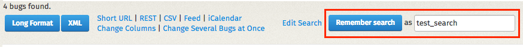

# Bugzilla for localizers

[Bugzilla](https://bugzilla.mozilla.org/) is the system used to track issues for most of Mozilla’s projects. For this reason, every localizer should [have an account on Bugzilla](https://wiki.mozilla.org/BMO/UserGuide#Creating_a_Bugzilla_Account), and check incoming emails and notifications. Since bugs need to be read and understood by several people, including developers, English is the language commonly used in Bugzilla.

Bugs are filed in a *Product*, each product has multiple *Components*. For localization, there are two main products:
* `Mozilla Localizations`: this product has several components, including one for each locale.
* `www.mozilla.org`: there is one specific component used for localization (*L10N*).

Bugzilla components are often referenced in the form of `product :: component`, e.g. `Mozilla Localizations :: it / Italian` or `www.mozilla.org :: L10N`. For some components, there is also a *Locale* field, that allows selecting one or more languages affected.

A bug has a *status*, the most common ones are:
* *UNCONFIRMED*: the bug was reported but it’s not confirmed yet. By default, a new user can only submit bugs as unconfirmed.
* *NEW*: the bug has been confirmed, but it still requires action.
* *RESOLVED*: the bug has been resolved.

When a bug is marked as *RESOLVED*, there is an [additional information](https://developer.mozilla.org/docs/Mozilla/Bugzilla/What_to_do_and_what_not_to_do_in_Bugzilla#Resolving_bugs) that describes the type of resolution:
* *FIXED*: the bug was fixed by a specific action.
* *INVALID*: the problem described is not a bug.
* *WONTFIX*: the problem described is a bug which will never be fixed.
* *DUPLICATE*: the problem is a duplicate of an existing bug.
* *WORKSFORME*: it wasn’t possible to reproduce the bug.
* *INCOMPLETE*: the bug doesn’t contain enough information to reproduce it, or a clear description of the issue.

When filing new bugs, the rule of thumb is:
* If the issue can be fixed by the localization team, e.g. it’s about a typo or mistranslation, it should be filed in `Mozilla Localizations :: Language` or `www.mozilla.org :: L10N`.
* If the issue needs work from a developer, e.g. a window is too narrow or a string is hardcoded, it’s a product bug, and should be filed accordingly. In case of doubt on which product or component to pick, `Firefox :: Untriaged` is usually a good starting point for Firefox bugs. If you’re reporting a bug for a specific string, you should [trace back](../tools/mercurial/tracking_back_string_to_bug) that string to a bug, and file your report in the same product and component.

More information about Bugzilla are available in [this guide](https://wiki.mozilla.org/BMO/UserGuide).

## Triage localization bugs

Each localization team should keep an eye on bugs filed for their languages. There are several ways to do it, the simplest one is to use the existing dashboards: both Pontoon and the [Team page](https://l10n.mozilla.org/teams/) have *Bugzilla* sections showing open bugs filed against each locale.

### Follow the Bugzilla component for your locale

The simplest way to keep your bugs under control is to follow your locale in *Mozilla Localizations*:
* Open [your account preferences on Bugzilla](https://bugzilla.mozilla.org/userprefs.cgi).
* Select *Component Watching* in the left sidebar.
* In the right section, select *Mozilla Localizations* as product, then your locale in the *Component* list.
* Click *Add*.

The product will appear in the section *You are currently watching:* right below. From this moment, you will receive an email for all bugs filed in – or moved to – that component.

There are a few limitations to this approach:
* It’s not possible to follow a single locale within a component, for example for `www.mozilla.org :: L10N`.
* By default, bugs marked as *UNCONFIRMED* won’t send any notification. In order to receive emails for unconfirmed bugs, you need to update the *Email Preferences* in your [profile](https://bugzilla.mozilla.org/userprefs.cgi), removing the flag from the *Component* column in the line `The bug is in the UNCONFIRMED state`.

### Saved searches

In Bugzilla, it’s possible to perform searches, and save them as templates. For example, let’s create a search for bugs reported against Italian in `www.mozilla.org :: L10N`.

Start from the [Advanced Search page](https://bugzilla.mozilla.org/query.cgi?query_format=advanced):
* Leave the search field empty.
* Select `www.mozilla.org` as Product.
* Select `L10N` as Component.
* Expand the *Custom Search* section at the bottom, and set it to *Locale* + *contains the string* + *it*.

When the results appear, you can use the *Remember search* button and input field to save this search.

The list of your saved searches can be displayed by clicking in the search field at the top of the page: you simply need to click one of the items to perform the search.

At the bottom of the page displaying search results, there’s a link to delete the saved search just performed (*Forget Search “NAME”*).

Note that you can select multiple products and multiple statuses (including *UNCONFIRMED*) to refine or expand the search criteria.

### Confirm and close bugs

As already explained, each locale should address the bugs reported for their language in a timely manner. Bugs filed as *UNCONFIRMED* should be triaged, marked as *NEW* if they’re actual bugs or closed, and marked as *fixed* once the problem is solved.

By default, users can’t confirm or close bugs filed by other users. In order to do that, you need a permission called `editbugs`, which is normally assigned to localizers only after they demonstrated a clear understanding of how Bugzilla works and its [etiquette](https://bugzilla.mozilla.org/page.cgi?id=etiquette.html). The reason for this is that this permission is assigned across the entire Bugzilla, not on single products or components. If you need to upgrade your permissions, get [in touch with l10n-drivers](https://wiki.mozilla.org/L10n:Mozilla_Team).
