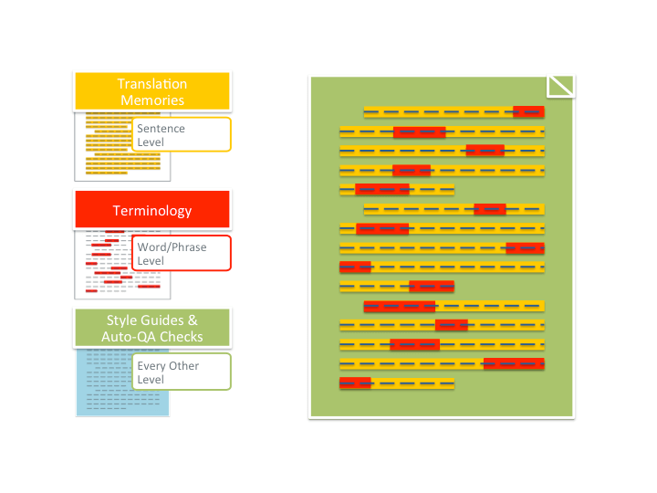

# Using l10n resources while translating

## What are l10n resources

L10n resources are used to ensure consistency of translation and localization at specific levels of a document or set of documents. These levels are:
1. Word or phrase level (terminology).
2. Sentence or string level (translation memory).
3. Whole document or project level (style guides).

### Terminology

Terminology resources define specific words or phrases and their translated equivalents to be used in the translation process. These resources often go beyond providing one-to-one bilingual equivalents. They can include metadata about a particular term, including a monolingual definition, part of speech, context, images, and other relevant metadata that helps the translator understand the concept behind the term. A term belongs in the approved term base (terminology database) when it appears regularly, has a singular meaning in a particular context, or is specialized in nature.

Term bases are useful in helping translators to maintain meaning and consistent terms across multiple projects. They’re especially useful in collaborative translation environments that involve multiple projects with similar content and audiences. Term bases also help to ensure that any new collaborators can translate effectively in a shorter period of time.

Using term bases ensures that a user’s experience is consistent across platforms, products, and content types. For example, terminology used in the Firefox desktop UI also appears in Firefox for Android, Firefox for iOS, and SUMO documentation. If a user encounters a problem in Firefox, they will expect to find a solution by searching SUMO with the text from the Firefox desktop user interface. Consistent terminology use ensures a holistically consistent user experience for such cases.

### Translation memory

Translation memory is a mechanism that reuses previously translated segments (i.e., strings, sentences, etc.). These segments are stored in a database as a key-value pair, with the source language segment as key and the target language segment as its value. Algorithms like the [Levenshtein Distance](https://en.wikipedia.org/wiki/Levenshtein_distance) are then used to compare an untranslated segment to the database of source language segments. If there’s a perfect match, the target language segment is returned for the translator to reuse. If there are partial matches (i.e., fuzzy match), they are returned as suggestions. Translators can then post-edit the closest matching suggestion without needing to repeat fully translating the segment.

Translation memory is useful in helping translators to translate more in a shorter amount of time. For example, it allows source content authors to make regular updates to source content without causing translators to treat these updates as untranslated segments. As with term bases, translation memory also ensures consistency between similar projects and collaborative translation projects with rotating contributors.

### Style guides

Style guides establish the norms for translating a full document or project. It establishes norms for many of the following topics:
1. Style.
2. Tone.
3. Grammar and spelling resources.
4. Instructions on handling cultural references.
5. Word forms (e.g., plurals, abbreviations).
6. Language and culture-specific units (e.g., dates, numerals, currency).
7. Criteria for identifying “Do-Not-Translate” content in a project.

Style guides help translators to know to address their audience (or users) in the target language when translating. They ensure consistency between translators in all of the above-mentioned topics. In a collaborative translation environment, they serve as the standard against which peers can review and correct translations from both new and old translators.

## When are they used in the l10n process

Term bases and translation memory are best used within the translation environment (e.g., Pontoon). These computer-assisted translation (CAT) tools are designed to make use of these resources as a translator is in the process of translating a project.

Style guides are used primarily as a point of reference. A new translator should always begin their contributions by studying the style guide and refer back to it regularly while translating when they have questions. Reviewers use style guides to ensure that new translations meet the quality standards established in the style guide.
