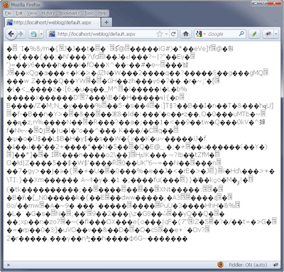
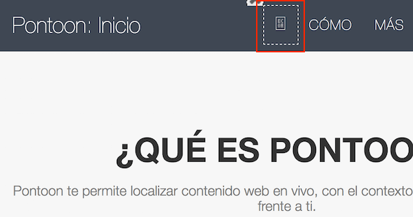
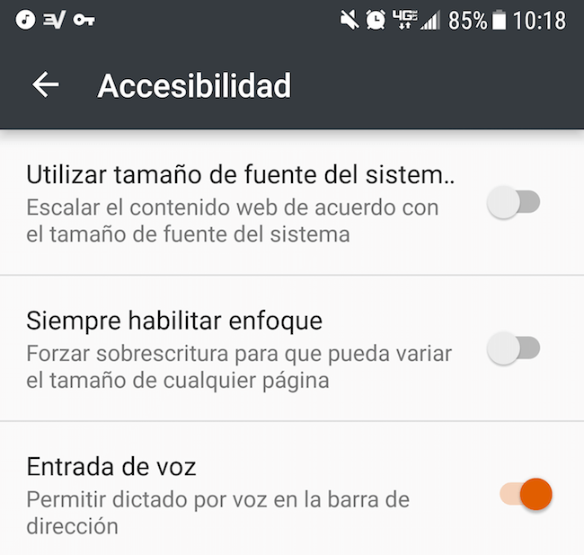
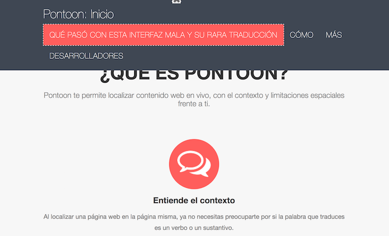
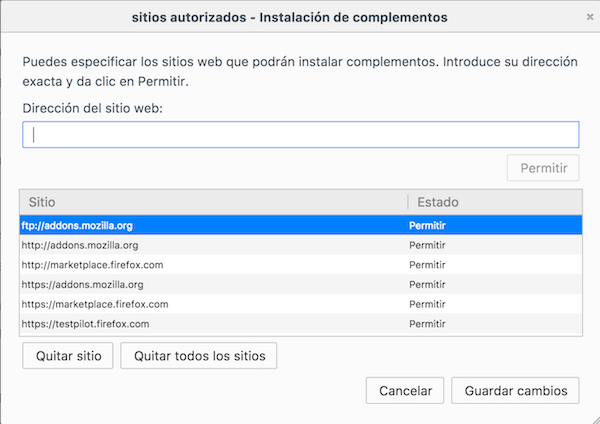
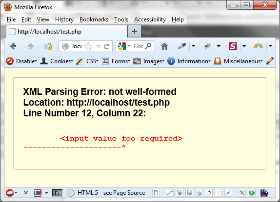
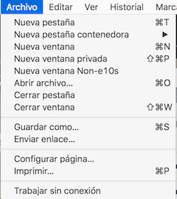

# Testing localization of Mozilla projects

Mozilla encourages a three-stage review process:
1. Linguistic review in Pontoon by community.
2. Technical review by l10n-drivers.
3. In-context localization testing by community and users.

Other documents will cover how the Mozilla approach to the first two stages of the review process. This document covers what to look for when performing in-context localization testing for a Mozilla product or Web project.

## Localization testing process

Each Mozilla project has its own process for taking your translations and making them available for you to test. Generally speaking, the process moves like this:
1. You submit a translation through Pontoon or directly to version control (Mercurial, GitHub).
2. The translation goes through a linguistic review and a technical review.
3. Once approved, the translation is automatically pushed into the project’s repository.
4. Depending on the project, you’ll need to wait anywhere from 30 minutes to 24 hours to look for your translation in the Mozilla project.
5. Once you’ve found your translation, if you see a problem with it, you return to Pontoon to make any necessary corrections.

Pontoon simplifies these steps for some Web projects by enabling the in-context editor (aka WYSIWYG editor). This allows you to see your translations in-context the moment you create them in Pontoon, cutting out the 30 minutes to 24 hours waiting period to test. Most projects do not have this enabled, however, so it is still important to know the typical testing process for your projects.

You might be wondering, “what sort of problems am I supposed to be looking for when I test?” Good question :-) Here’s a list of common localization bugs with screenshots that illustrate the problems in context.

## Common localization bugs

### Encoding and fonts

Character encoding errors occur when the browser can’t find the correct symbol to display for a character. Normally, you will recognize these errors when you see Unicode replacement characters (�), or strange glyphs, instead of letters or radicals in your language. In some cases the problem can be resolved by changing your browser’s default encoding, in other cases the problem is due to the website not serving content with the right encoding and can be fixed only by the website’s owner.

Fonts that do not include full support for a language’s set of glyphs can present similar issues, for example showing incorrect line spacing (leading), character spacing (kerning), or missing ligatures between characters. In the example below, the kerning of the Cherokee letters is too wide. This may be fixed by using a different font on the site.

### Truncation

Truncation happens when a translation is too long to fit in its corresponding space in the user interface. This error can cause problems with transmitting the right meaning to the user by hiding part of the translation from view. It can be corrected in one of two ways:
* The developer increases the UI space to accommodate longer translations.
* The localizer creates a shorter translation that captures the primary message but may not capture secondary or tertiary messages.

### String reuse

String reuse occurs when the same string is used in different contexts, and it represents a poor approach to localization.

Consider for example a string like *Add to bookmarks*: developers might consider a good idea to reuse the same string for both a button label and button tooltip, since it works fine for English. On the other hand, other languages might have completely different needs for these two contexts: while the button indicates an action (imperative verb), the tooltip is used to describe the action associated to the UI element and might need a sentence using a verb with the third person, and the element itself as implicit subject.

### String concatenation and empty strings

String concatenation occurs when a developer takes one string, splits it into multiple strings, and tells the code to display these strings one after another.

This is often used to overcome technical limitations, like including a link in the middle of a sentence without exposing HTML tags to localization and injecting unsafe HTML in the UI.

Empty strings are also common when creating a sentence with a link. Typically 3 strings are used: before_link + link + after_link. English doesn’t need the part before or after the link, but that’s useful for other languages, so they’re kept empty in English. It’s expected for some locales to have a completely different behavior than English.

### UI layout

Translated text often requires more space than the same text in the source language. For example, when translating between English and German, it’s common practice to expect a length increase of 30%. This can cause problems as wrapping text elements cause different parts of the user interface move around to accommodate a longer string. To fix this, the translator often needs to create a new, shorter translation that captures the primary meaning, but might lose some of the secondary or tertiary meaning.

### Mistranslation

Mistranslation occurs when meaning is lost between the source language and the target language. This can be caused accidentally by a lack of context for where a translation will be placed within a user interface (very common in software localization), a translator’s lack of subject matter expertise, or intentionally due to user interface text constraints (e.g., truncation).

### Untranslated strings

Untranslated strings appear in a user interface when developers don’t include that string in the string resource files available for localization, but instead in their code. It’s a practice called *hardcoding*. The best way to correct this error is to make sure that Pontoon does not contain the string for translation (or that it’s not in the string resource files) and then contact developers using Bugzilla to make the string available for localization.

### Style bugs

Mozilla’s official style guide serves as a primer to help communities create their own style guides. Style errors are when the tone or appearance of a translation does not match the tone or appearance described in a style guide. These can be corrected by making sure that localizers understand the style guide rules and follow them when translating.

### Numbers, date, currency

Every language and region displays numbers, dates, and currency differently. These errors occur when the user sees an incorrect number format, date format, or currency for the language and region of their localized Firefox. This can be fixed by filing a bug in Bugzilla.

### XML parsing errors

XML parsing errors (aka “the yellow screen of death”) cause Firefox to display a yellow error page. This is often due to a broken translated string in that localization of Firefox which causes the Firefox build to break. With Fluent, these errors will no longer be relevant.

### Exposed variables and placeholders

Variables and placeholders become exposed in the user interface when the translated string has a typo within the variable or placeholder. Because it is not exactly the variable that the software or website expected to find, the system simply displays the variable rather than its value. A very common example of this is with the variable `&brandShortName`. If that variable is typed correctly in the translation, it will return the variable’s value (in this case, it’s `Firefox`). If it contains a typo, the user will see the variable instead (e.g., `&brandshortname`). These are discoverable in the Mozilla localization dashboards and can be corrected in Pontoon.

### Broken access keys

Access keys are less effective when the same key is assigned to multiple functions within the same scope (menu, preference panel, etc.). Additionally, if the access key uses a letter not available in the label, it’s displayed near the label between parentheses. Multiple identical access keys in the same context (preference menu, toolbar menu) will require the user to press the letter twice to use it. Ideally, repetitions should be avoided, but that’s not possible in some places, e.g. the reorganized preferences shipping with Firefox 56 and later.

It’s possible to see a list of access keys using letters not available in the associated label in your Firefox localization by looking at [this page in Transvision](https://transvision.mozfr.org/accesskeys/) for your locale.

### Broken language preferences

Users experience broken website language preferences in Firefox when the accept-lang preferences are left unchanged from the en-US default set of language preferences. This can lead to the user receiving web pages in a language they’re unfamiliar with by default, even when the web page is localized into their native language. It can be fixed in `toolkit/chrome/global/intl.properties` in the `accept-lang setting`.

### Broken searchplugins

Users experiencing a broken searchplugin will receive a “website unreachable” message when they attempt to perform a search from their awesome bar or search bar. If you discover that a searchplugin is broken, please file a bug with the l10n-drivers.

### Broken hyperlinks

Broken hyperlinks occur in a couple of different ways:
1. When there are typos in the hyperlink markup, the markup is then exposed to users.
2. When the hyperlink links to a site that is not obvious by the text it’s linked to (e.g., linking to the wrong support article according to the link’s context).
These can only be discovered by using the website or software regularly and clicking each hyperlink available to ensure that they take the user to the intended website.

## What to do when you find an error while testing

Congratulations! You’ve found a bug! No software is perfect and you’re very likely to find bugs while you test your localization. Once you’ve found a bug, you can either attempt to find the affected string in your community’s Pontoon projects or you can [file a bug in Bugzilla](https://bugzilla.mozilla.org/enter_bug.cgi?product=Mozilla%20Localizations) for that language in Mozilla Localizations :: [your_locale]. Once a fix for that bug is landed, it’s important to test again to be sure that the issue has been resolved.

For project-specific testing guides, please see these pages:
* [Addons.mozilla.org (AMO)](../webprojects/amo.md).
* [Firefox Desktop](../products/firefox_desktop/testing.md).
* [Firefox for Android](../products/firefox_android/testing.md).
* [Firefox for iOS](../products/firefox_ios/testing.md).
* [Mozilla.org](../products/mozilla_org/testing.md).
* [Snippets](../webprojects/snippets.md).
* [Support.mozilla.org (SUMO)](../webprojects/sumo.md).
