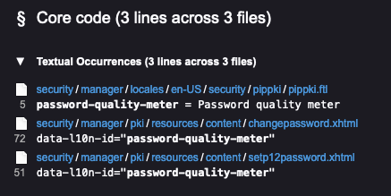
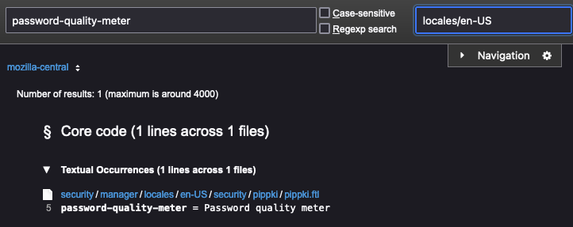
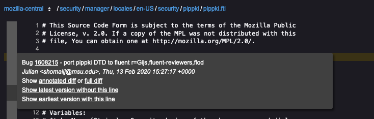
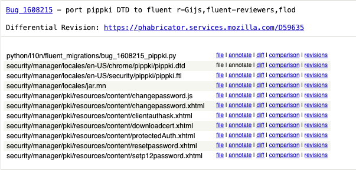
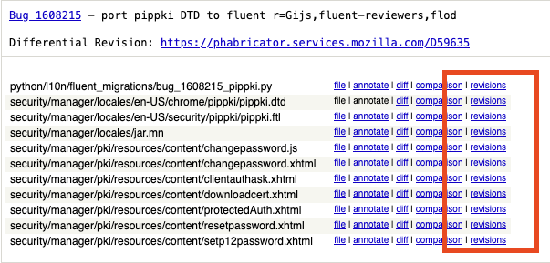

# How to identify Bugzilla bugs that introduced a string

Sometimes it’s helpful to identify which bug on [Bugzilla](https://bugzilla.mozilla.org) introduced a specific string, for example to check if an issue was already reported, or find out more information on a feature.

Note: These instructions apply only to projects that make use of Bugzilla, which currenly are Firefox projects for desktop and Android.

## Find the string

The first step is to identify where the string is within the Mercurial repository by using [Searchfox](https://searchfox.org/).

For example, if you want to know which bug introduced the string `Password quality meter`, you can search for the [string](https://searchfox.org/mozilla-central/search?q=Password+quality+meter&path=&case=false&regexp=false). This may return multiples strings with the same text, so to find the exact string you can use the the [identifier](https://searchfox.org/mozilla-central/search?q=password-quality-meter&path=&case=false&regexp=false) (which can be found from [CONTEXT](../pontoon/workspace.md#context) in Pontoon).

The results may look something like this:

You can further refine results to only localization files by using specific localization file extensions in the `Path filter` field in the top right:
* For Firefox: limit the search to `.ftl` or `.properties` files. You can find information on the file from its [CONTEXT](../pontoon/workspace.md#context). Or you can use `{.ftl,.properties}` to only show files with those extensions.
* For Android: limit the search to `.xml` files.

Clicking on the string will open the file in Searchfox and highlight the string.

## Find the bug

Searchfox shows details on the revision in which each line of code was introduced to the file, represented on the left hand sign as a bar with alternating shades of gray. Hovering over the bar next to the highlighted line containing your string will show you the revision details. The first line of the revision details contains a bug reference, a number represented as a link. Clicking the link will take you to Bugzilla where you can then check things like dependencies and comments.

### Examining the changeset in Mercurial

You can also access the changeset in Mercurial. To view that, click `full diff` on the third line that says `Show annotated diff or full diff`.

This will show the full commit message and all the changes made as part of the bug.

## Looking at older revisions

The above method doesn’t always work: sometimes a changeset only moves strings around, so you would need to repeat the process for an older revision of the file.

If a string was moved, the changeset for the earliest version will show the bug that moved it. In Searchfox, from the bar on the lefthand side next to your string, you can click `Show earliest version with this line`. From the page that follows, hover over the left bar next to the string and click `full diff` to show the changeset for that revision in Mercurial.

Near the top of the changeset, there’s a list of the modified files. Near each file there’s a **revisions** link.

After clicking **revisions**, you can pick an older changeset of a file by clicking the **diff** link next to the changeset you’re interested in, or repeat the process by selecting **annotate**. This will display the revision associated to each line of that changeset.
