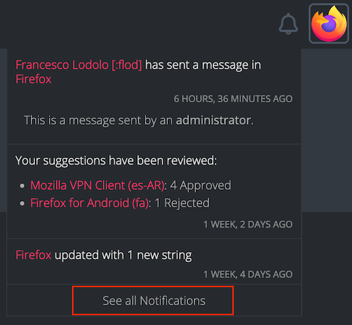

# Notifications

Tracking updates across several projects can quickly become challenging. Pontoon tries to support users across different roles by sending notifications, to make sure important updates don’t get lost. Administrators can also use notifications to send messages about specific projects.

When the user receives a notification, the bell icon near the user avatar in the top right corner will show a badge with the number of unread notifications. Clicking the bell icon will display the latest notifications in a dropdown menu.

Clicking `See all Notifications` at the bottom will take the user to the complete list of notifications. The same list can also be accessed by opening the `/notifications` URL directly (e.g. [pontoon.mozilla.org/notifications](https://pontoon.mozilla.org/notifications/)).

## Receiving notifications in the browser

It’s possible to receive Pontoon’s notifications directly in the browser by installing the Pontoon Add-on. This add-on is available for both [Firefox](https://addons.mozilla.org/firefox/addon/pontoon-tools/) and [Chrome](https://chrome.google.com/webstore/detail/pontoon-add-on/gnbfbnpjncpghhjmmhklfhcglbopagbb).

## Disabling notifications

Pontoon includes several types of notifications and most of them can be [manually disabled](users.md#notification-subscriptions) by users if they don’t find them useful.

## Notification types

### New strings

This notification informs users when new strings are added to a project. The notification is sent to all users who contributed translations to that project, as soon as new strings are available.

### Project target dates

This notification informs users when a project is incomplete and it’s approaching the target date. The notification is sent to all users who contributed translations to that project, the first time 7 days before the target date, then again 2 days before.

### Comments

Pontoon distinguishes between two types of comments:
* **Translation comments** are associated with a specific translation. These comments are displayed under the translation itself.
* **Source string comments** are associated with the source string. These comments are displayed in the `COMMENTS` tab in the right column.

For either type of comment, a notification is sent as soon as a comment is added.

For translation comments, the recipients are:
* Authors of other translation comments associated with the same translation.
* Translation author.
* Translation reviewer.

For source strings comments, the recipients are:
* Users with the ability to review translations for the string.
* Authors of translation comments.
* Authors of source string comments.
* Translation authors.
* Translation reviewers.

### New suggestions ready for review

This notification is sent once a week to inform reviewers about new suggestions needing a review. It includes information about suggestions that were submitted, unapproved or unrejected over the last 7 days. Recipients include users with permissions to review these suggestions — translator and team managers — as well as the authors of previous translations or comments in the same string.

### Review actions on own suggestions

This notification is sent once a day to authors of suggestions, to inform them that their work has been reviewed.

### New team contributors

This notification is sent to team managers, as soon as a new user makes the first contribution to their team.

### Badge level gained

This notification is sent to a user upon gaining a new [badge level](profile.md#achievement-badges) from reviewing a translation, submitting a translation, or promoting a user.

### Manual notifications

Administrators can send manual notifications to a project, including all locales or a subset of them. Unlike other types of notifications, this can’t be disabled.
