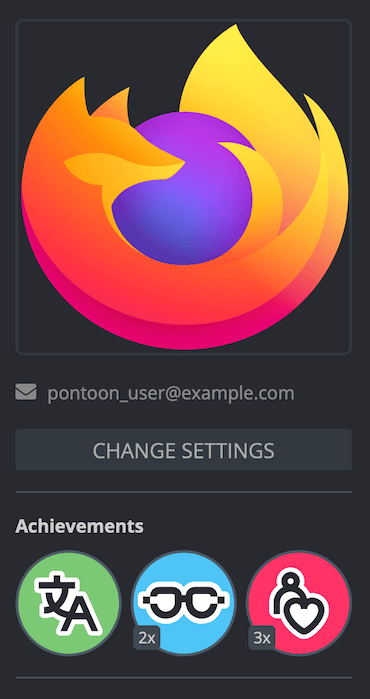

# Profile page

The goal of the profile page in Pontoon is to provide a tool to showcase contributions, display useful contact information about the user, and help team managers to organize and grow their communities. A user’s personal profile page can be reached by clicking the avatar icon in the top right corner, and then clicking the profile picture in the dropdown menu, or by using the `/profile` URL (e.g. [pontoon.mozilla.org/profile](https://pontoon.mozilla.org/profile)). Users can also view others’ personal profiles by clicking a user’s profile picture wherever it appears, such as in the list of contributors for a team or project.

The left column includes information about the user:
* Profile picture and name.
* Contact details.
* Achievement badges.
* Information on last known activity (when the user has submitted or reviewed a translation), last login in Pontoon, and the account’s creation date.
* Roles in Pontoon (a user can have multiple roles across different locales).

Users can customize their information and the visibility of specific fields in the [settings page](users.md#user-settings) (reachable using the `CHANGE SETTINGS` button).

## Achievement badges

Achievement badges awarded to a user are displayed beneath their contact information. The available badge types, from left to right in the image below, include:
* **Translation Champion**, awarded for submitting translations.
* **Review Master**, awarded for reviewing translations.
* **Community Builder**, awarded for promoting users to higher roles.

Each badge has multiple levels. If a user holds a badge at level two or higher, the level is shown at the bottom left of the badge icon.

Once a new badge or badge level is achieved, users will be notified with a pop-up tooltip on their screen.

## Activity graphs

In the top central section there are two graphs:
* **Approval rate** shows the ratio between the number of translations approved and the total number of translations reviewed, excluding self-approved translations.
* **Self-approval rate** is only visible for users with translator rights, and shows the ratio between the number of translations submitted directly — or self-approved after submitting them as suggestions — and the total number of translations approved.

If both graphs are available, it’s possible to switch between them using the selector at the bottom (highlighted in red in the image above)

Right below these graphs, there is a section showing a graphical representation of the user’s activity in the last year. Each square represents a day, while each row represents a day of the week. The brighter the color, the higher the number of contributions on that day.

By default, the chart will show data for **all contributions** over the last year, but it’s also possible to limit the chart to:
* Submissions.
* Reviews performed.
* Reviews received.
* Submissions and reviews.

The activity log below this chart will display the user’s activity in more detail for the last month. Clicking on a specific square (day) in the chart will only show the activity for that day. Each line item in the activity log is a link that allows to jump to those specific strings in the translation editor.
