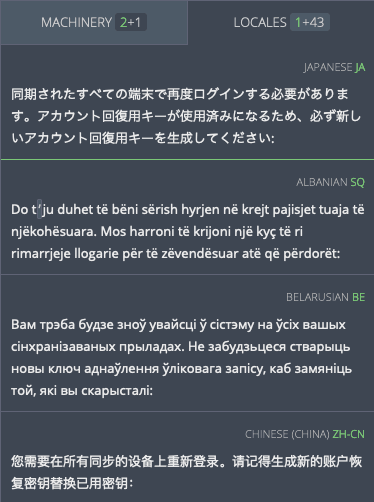

# Translation resources

<!-- toc -->

Pontoon features built-in access to different [translation memories](glossary.md#translation-memory) and tools to support translators in their work.

## History

Pontoon displays the translation history for strings below the editor. The current approved translation for a source string appears at the top, with all previous suggestions and translations beneath.

Each entry contains:
* The name of the translator and their profile picture (linking to their profile).
* How long ago the entry was submitted (hover over to see the full date and time as a tooltip).
* The translation.
* Icons indicating translation status (see below).
* [Translation comments](glossary.md#comment). `COMMENT` will display the number of comments, if any exist for the translation.

Icons to the right indicate the status of each translation:
* The solid green circle with checkmark indicates that the translation has been approved.
* The outlined lime green circle with checkmark indicates a pretranslation that has not yet been reviewed.
* If both icons are gray, translation has been suggested but not yet reviewed.
* The red cross indicates that the translation has been rejected. The entire element will look opaque.
* The trashcan, available only for rejected translations, can be used to completely delete a translation.

### Viewing translation differences

The `DIFF` option appears if there are multiple translations for one string. Toggling `DIFF` compares the text to the current approved translation, or the most recent suggestion if no translation has been approved yet. Text highlighted in green indicates content that has been added, while strikethrough text in red indicates removed content. Toggling `DIFF` again will display the original string.

## Machinery tab

The Machinery tab in the translation view shows possible translations from a variety of sources. These sources include:
* [Pontoon’s internal translation memory](translate.md#downloading-and-uploading-translations).
* [Microsoft Terminology](https://www.microsoft.com/Language/).
* [Google Translate](https://translate.google.com).

In addition, the user has the ability to search for translations containing words via [`Concordance search`](#concordance-search).

In the tab, the number of entries is visible alongside the `MACHINERY` title in white. If any of the machinery matches are from translation memory, the number of matches will appear separately in green. For example, the screenshot below shows `2+1`, where the green `2` represents the two matches from translation memory and the `1` represents a machinery entry from Google Translate.

At the top of each entry, a diff view compares the current source string and the source string from the machinery entry. Strikethrough text highlighted in red indicates text that is present in the source string but not in the machinery source string, while text highlighted in green indicates text available only in the machinery source string.

To the right of the entry, the number in green shows the percent match between the machinery string and the source string. The higher the percentage, the more likely the machinery is to be useful. The machinery source is listed in gray. Upon clicking the gray text, the machinery source will be opened in a new window. The green superscript to the right indicates the number of matches for the entry in the translation memory source.

Be careful when using the machinery tab as suggestions may not match the source string for the project being translated. Even if the source strings match, the context in which strings are used may not be the same. This could lead to incorrect or unnatural translations. Always keep the meaning and purpose of the string being translated in mind when using the machinery tab.

### Concordance search

Concordance search allows users to search across all projects in Pontoon. Users can search for translations using strings in either source or target language. Matching results are displayed with the source string, translation, and project name; clicking a result will automatically fill the translation into the editor. Note that the search does not need to be related to the current string or project.

### Stand-alone machinery

Pontoon machinery is also available as a [stand-alone web page](https://pontoon.mozilla.org/machinery/). To access the page, use the `Machinery` link available in the Profile menu, or the `Machinery` tab in the upper navigation displayed in some pages (e.g. *Teams page* or *Projects page*).

To use the machinery, select the target locale from the dropdown menu to the right of the searchbar. Then input the English source string into the searchbar and press enter. This will display all matching machinery entries. Information is organized exactly as in the translation workspace.

## Locales tab

The locales tab shows approved translations from Pontoon projects in other [locales](glossary.md#locale).

Next to the `LOCALES` title, the number of available entries is visible. The number of preferred locales is in green, all other locales are listed in gray.

To add a locale to the preferred locale list, access the [user settings](users.md#user-settings) page.

Entries in the `LOCALES` tab above the green line are preferred locales. Entries below the green line are not preferred locales.

At the left of the entry, the translation for the source string in the selected locale is visible. At the right of the entry, the language name is visible in gray, while the locale code is displayed in green.

The `LOCALES` tab is useful for seeing what general style choices are made by other localization communities. When encountering a difficult string, a translator can reference the methods that have been used by other languages in making a stylistic decision.

Note that when using the `LOCALES` tab the translator should always opt for fluency in the working locale. Languages vary linguistically on many levels. The locales tab can be extremely useful, but should be used carefully, and rarely as the sole translation resource for translation.
