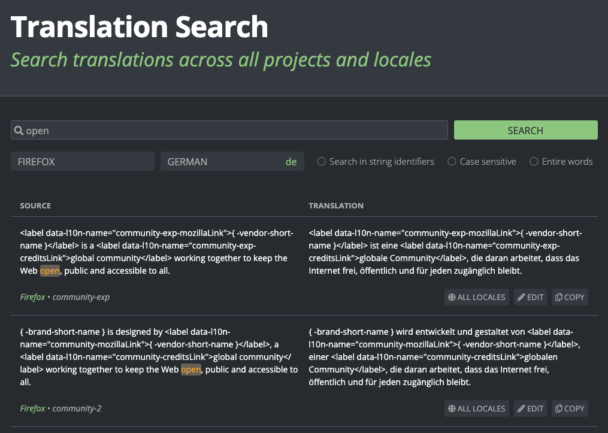
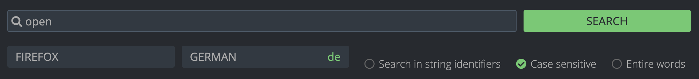
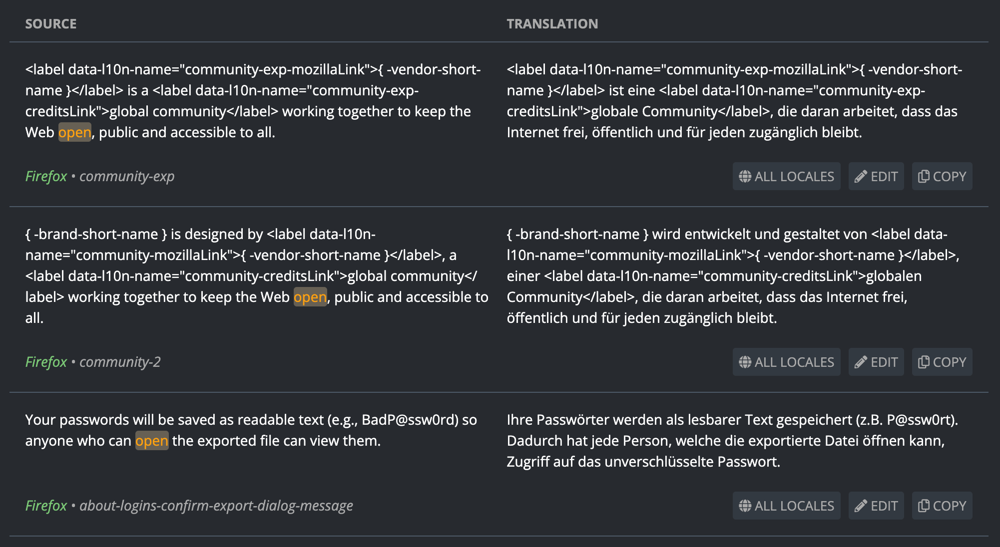
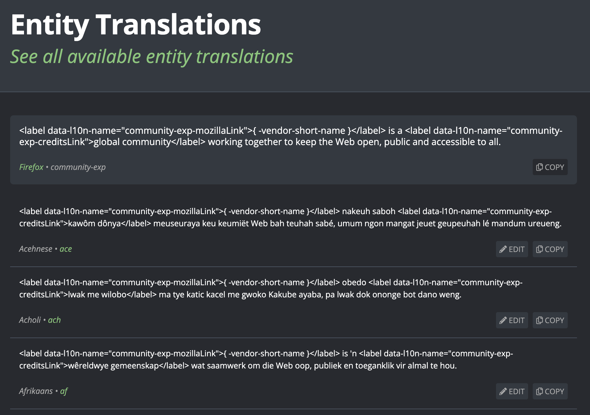
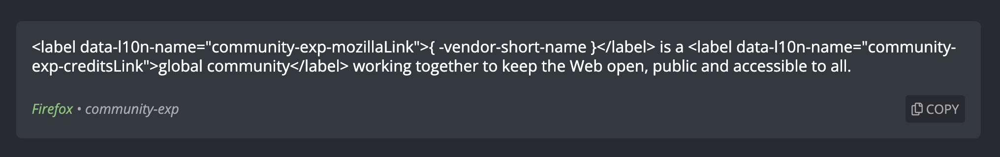

# Translation Search and Entity Translation pages

<!-- toc -->

The Translation Search page, accessible using the `/search` URL (e.g. [pontoon.mozilla.org/search](https://pontoon.mozilla.org/search/)), allows users to search for translations across all projects and locales in Pontoon. From the search results, users can access the [Entity Translation page](#entity-translation-page), which displays all available translations for a specific source string across all locales.

## Translation Search page

The Translation Search page provides a powerful interface for searching translations. It can be reached by using the `/search` URL (e.g. [pontoon.mozilla.org/search](https://pontoon.mozilla.org/search/)).

### Search interface

The main search interface consists of:

* **Search field**: A text input where users type their search query. Press `Enter` to execute the search.
* **Project selector**: A dropdown menu to filter results by a specific project, or search across "All Projects" (default).
* **Locale selector**: A dropdown menu to select the target locale for translations. Defaults to the user's preferred locale or "en-GB".
* **Search options**: A group of checkboxes to further filter based on user preferences.

Both the project and locale selectors include a search field to quickly filter through available options.

#### Search options

Three checkbox options allow users to refine their search:

* **Search in string identifiers**: When enabled, the search also matches against string keys/identifiers (e.g., `community-exp`), not just the source and translation strings. This option is only relevant for non-gettext formats.
* **Case sensitive**: When enabled, the search becomes case-sensitive. For example, searching for "Firefox" will not match "firefox".
* **Entire words**: When enabled, the search matches only complete words. For example, searching for "fire" will not match "Firefox".

### Search results

Search results are displayed in a two-column layout:

* **Source column**: Shows the original source string.
* **Translation column**: Shows the translation in the selected locale.

Matching text is highlighted in both columns to make it easy to identify where the search query was found.

Each search result entry includes:

* **Project name**: A link to the project page.
* **String identifier**: The key or identifier for the string (displayed for non-gettext formats).
* **Action buttons**:
  * **All Locales**: Opens the [Entity Translation page](#entity-translation-page) to view translations in all available locales.
  * **Edit**: Opens the translation string in the [translate workspace](translation_workspace.md) for direct editing.
  * **Copy**: Copies the translation string to the clipboard.

If no translations are available, a message "No results found." is displayed.

#### Infinite scroll

Search results are loaded progressively as the user scrolls down the page. When the user approaches the bottom of the current results, additional results are automatically fetched and appended. This allows for efficient browsing of large result sets.

### URL parameters

The search state is preserved in the URL, making it easy to share or bookmark specific searches. The following URL parameters are supported:

* `search`: The search query text.
* `locale`: The locale code (e.g., `de`, `fr`, `ar`).
* `project`: The project slug to filter by.
* `search_identifiers`: Set to `true` to enable searching in string identifiers.
* `search_match_case`: Set to `true` for case-sensitive search.
* `search_match_whole_word`: Set to `true` to match entire words only.
* `pages`: The number of result pages that have been loaded (used to restore scroll position).

Example URL: `/search?search=Firefox&locale=de&project=firefox&search_match_case=true`

## Entity Translations page

The Entity Translations page displays all translations for a specific string across all available locales. It can be accessed in two ways:

1. By clicking the "All Locales" button on a search result in the Translation Search page.
2. By navigating directly to `/entities/{entity_id}/` (e.g. [pontoon.mozilla.org/entities/123](https://pontoon.mozilla.org/entities/123/)).
An alternate URL format is also available: `/entities/{project_slug}/{resource_path}/{entity_key}/` (e.g. [pontoon.mozilla.org/entities/firefox/browser/branding/official/brand.ftl/-brand-shorter-name](https://pontoon.mozilla.org/entities/firefox/browser/branding/official/brand.ftl/-brand-shorter-name/)).

### Source string section

At the top of the page, the source string is displayed in a highlighted container, including:

* **Source string**: The original text to be translated.
* **Project name**: A link to the project page.
* **String identifier**: The key or identifier for the string (displayed for non-gettext formats).
* **Copy button**: Copies the source string to the clipboard.

### Translation list

Below the source string, a list shows all translations across available locales:

* **Translation string**: The translated text.
* **Locale information**: The locale name and code, which links to the team page.
* **Action buttons**:
  * **Edit**: Opens the string in the [translation workspace](translation_workspace.md) for editing in that specific locale.
  * **Copy**: Copies the translation text to the clipboard.

If no translations are available, a message "No translations found." is displayed.

