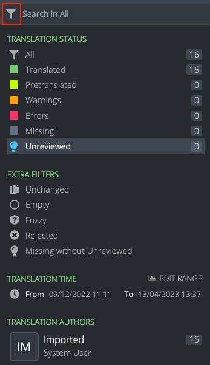

# Search and filters

<!-- toc -->

## Search

It’s possible to search within a project using the search field. Searches include strings, string IDs and comments.

Note that searches take active [filters](#filters) into account, for example a search would be performed only on missing strings if that filter was previously selected.

Like in search engines, by default Pontoon will display matches that contain all the search terms. For example, searching for `new tab` will match both `Open links in tabs instead of new windows` and `New Tab`.

To search for a perfect match, wrap the search terms in double quotes, e.g. `"new tab"`. On the other hand, to search for strings that contain double quotes, escape them with a backslash, e.g. `\"`.

## Filters

### Translation status

Strings in Pontoon can be filtered by their status. A string can be in one of the following statuses:
* *Translated*: string has an approved translation. The translation is saved to the localized file when using a [version control system](glossary.md#version-control-system) (VCS).
* *Pretranslated*: string has been pretranslated but has not been reviewed. Unreviewed pretranslation are saved to the localized file when using a VCS.
* *Warnings*: string contains issues classified as [warnings](translate.md#warnings).
* *Errors*: string contains [critical issues](translate.md#errors).
* *Missing*: string doesn’t have any approved translations.
* *Unreviewed*: string has suggested translations that have not been reviewed yet by someone with the appropriate [permissions](glossary.md#permission). Note that, for both translated and missing strings, the suggested translation only exists within the Pontoon database and is not saved to the localized file when using a VCS.

### Extra filters

In addition to statuses, additional filters can be used to further refine the list of strings. Extra filters include:
* *Unchanged*: string is identical to the reference language (normally en-US).
* *Empty*: string has a translation, but translation contains no content.
* *Fuzzy*: string is marked as [fuzzy](glossary.md#fuzzy) in the localized file.
* *Rejected*: string has rejected translations.
* *Missing without Unreviewed*: string has `Missing` translation status and does not have `Unreviewed` translations.

Filters can be accessed by clicking the icon on the left of the search field.

At this point it’s possible to:
* Click directly on the name of one of the filters. This will select and activate only this filter, and the search field placeholder will change accordingly. For example, clicking on *Missing* will show only missing strings, and the placeholder will read *Search in Missing*.
* Click on one or more filter icons or user avatars (multiple filters can be applied at once). Hovering over the icons transforms the icon into checkmarks. Clicking an icon will select that filter and a new button *APPLY X FILTERS* will appear at the bottom of the panel, where `X` is the number of active filters.
* Click *EDIT RANGE* on `TRANSLATION TIME` to select a **time range**. Pick one of the defaults (30 days, 7 days, 24 hours, 60 minutes), or use the date picker (or slider) to adapt the range. Click on *SAVE RANGE* to store the range as a filter. A new button *APPLY X FILTERS* will appear at the bottom of the panel, where `X` is the number of active filters.

In this case 3 filters are selected.

### Tags

For specific projects it’s also possible to filter strings based on *tags*. Tags are used to logically group resources based on their priority, allowing localizers to focus their work on important strings first, and project managers to better assess the overall localization status of the project.

In this case, there are 10 tags defined for the project (highlighted in red). Near each tag there is a representation of the priority: like for projects, it goes from 5 stars (highest priority) to 1 star (lowest priority).
