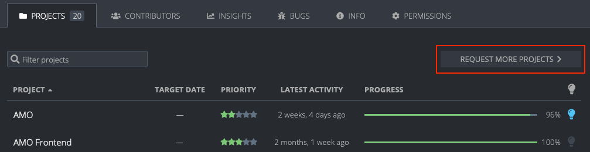
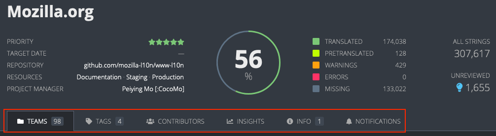
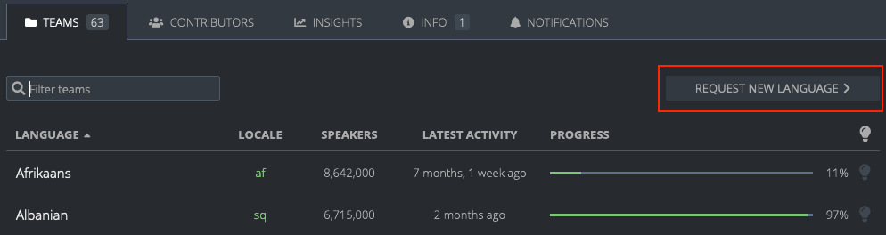

# Teams and projects

<!-- toc -->

The [Teams page](https://pontoon.mozilla.org/teams/) lists all locales that are enabled in Pontoon. From here specific [Team pages](#team-page) can be accessed, which contains a list of all projects enabled for the requested locale. Selecting a project from the *Team page* leads to what is called the [Localization page](#localization-page).

From each locale’s *Team page* it’s also possible to [Request a project](#requesting-a-project). Note that this is a request to add the locale to a project already available in Pontoon, not for requesting a brand new project.

The [Projects page](https://pontoon.mozilla.org/teams/) lists all projects that are available in Pontoon. From here the list of locales that are enabled for the requested project can be accessed. This is called a [Project page](#project-page) in Pontoon. Access the [Localization page](#localization-page) by selecting a locale in the *Project page*.

There is also a special Localization page that allows access to all resources for all projects enabled for a specific locale: `/locale/all-projects/all-resources`.

The following diagram shows how these pages are organized and connected to each other:

## Teams

### Teams page

The Teams page lists all locales that are enabled in Pontoon. It can be reached by clicking `Teams` from the navbar or by using the `/teams` URL (e.g. [pontoon.mozilla.org/teams](https://pontoon.mozilla.org/teams/)). Clicking on a specific locale will open the locale's [Team page](#team-page).

### Team page

Access a specific team’s page by selecting it from the *Teams page* or by appending a locale code to the end of the Pontoon base URL with `/{LOCALE}` (e.g [pontoon.mozilla.org/it](https://pontoon.mozilla.org/it) for Italian). This page shows a list of all projects enabled for the locale. Clicking on one of these projects leads to the [Localization page](#localization-page).

The page header contains linguistic information about the current locale (plural form, writing direction, etc.), plus an indication of the overall status of completion and statistics. The statistics displayed in the rightmost column are active links to access the Localization page for all projects. For example, select `MISSING` to see all missing strings across projects enabled for that locale in Pontoon.

There are 5 tabs available to all roles, and 1 additional tab for those with *Administrator* or *Team manager* roles (highlighted in red above):

* **Projects**: a list of all projects enabled in Pontoon for this locale.
* **Contributors**: a list of active contributors with their statistics, filterable by time (all time, last 12/6/3/1 months).
* **Insights**: contains data and trends presented in a graphical format about active users, time to review suggestions, review activity, and translation activity.
* **Bugs**: a list of open bugs for this locale, retrieved from [Bugzilla](https://bugzilla.mozilla.org/).
* **Info**: information about the team. Team managers can edit this by clicking on the Edit button.
* **Permissions**: [manage user permissions](users.md#managing-permissions).

The labels and icon in the table header can be used to sort the list of projects. For example, clicking on `Priority` will sort based on project priority.

Hovering a project in the *Projects* list will replace the progress bar with a set of detailed statistics (untranslated strings, missing strings, etc.). Note that all these numbers are links, use them to open the project with a filter already enabled, for example to display only missing strings. Clicking `ALL` accesses *All Resources* (i.e. all strings in all files) for this project.

The rightmost column in the table will display a blue lightbulb icon if there are unreviewed strings. Note: clicking the lightbulb icon in the table header can be used to sort projects based on the number of unreviewed strings.

### Requesting a project

It’s possible to request a project from a locale’s *Team page*. Note that this is a request to add the locale to a project already available in Pontoon, not for requesting a brand new project.

Click on `REQUEST MORE PROJECTS` (highlighted in red), select the project to add and then click `REQUEST NEW PROJECT` (at least one project needs to be selected for the button to be displayed).

An email will be sent to Pontoon’s administrators, and the localization driver in charge of the project will act on the request. Please note that:
* Some projects have a closed list of supported locales, meaning that these projects can't be requested on Pontoon.
* Some projects can be requested but may not be enabled for practical restrictions related to the project itself (e.g. lack of support for the locale in iOS).

## Projects

### Projects page

The Projects page lists all projects that are available in Pontoon. It can be reached by clicking `Projects` from the navbar or by using the `/projects` URL (e.g. [pontoon.mozilla.org/projects](https://pontoon.mozilla.org/teams/)). Clicking on a specific [Project page](#project-page) will open the project's [Project page](#project-page).

### Project page

Access a project’s page by selecting it from the *Projects page* (e.g. [pontoon.mozilla.org/projects](https://pontoon.mozilla.org/projects/)). This page shows a list of all locales enabled for the project. Clicking on one of these locales leads to the [Localization page](#localization-page).

The page header contains useful information about the current project:
* **Priority**: priority from 5 stars (highest) to 1 star (lowest).
* **Target Date**: set only for some projects, it indicates when the translation is due.
* **Repository**: link to the repository storing translations for this project.
* **Resources**: links to useful external resources. Custom links can be defined for each project.
* **Contact person**: localization driver in charge of this project.

It also includes an indication of the overall status of completion and statistics across all enabled languages.

There are up to 5 tabs available to all roles, and 1 additional tab for those with *Administrator* roles (highlighted in red above):

* **Teams**: a list of all locales enabled in Pontoon for this project.
* **Tags**: a list of tags defined for this project. This tab will be visible only in projects where tags are enabled. For more information about tags, see [this page](search_filters.md#tags).
* **Contributors**: a list of active contributors with their statistics, filterable by time (all time, last 12/6/3/1 months).
* **Insights**: contains data and trends presented in a graphical format about review activity and translation activity.
* **Info**: information about this project.
* **Notifications**: contains functionality to notify those who have contributed to this project for defined locales.

### Requesting a language

It’s possible to request an additional language for some projects from its *Project page*.

Click on `REQUEST NEW LANGUAGE` (highlighted in red), select the language to add and then click `REQUEST NEW LANGUAGE`.

An email will be sent to Pontoon’s administrators, and the localization driver in charge of the project will act on the request. The same restrictions described in the [Requesting a project](#requesting-a-project) section apply here.

## Localization page

Access a project’s *Localization page* in two ways:
* By selecting it from the [Team page](#team-page).
* By selecting it from the [Project page](#project-page).

The page header contains useful information about the current project (same as the [Project page](#project-page)).

There are 6 tabs available (highlighted in red):
* **Resources**: files available in the project.
* **Tags**: a list of tags defined for this project. This tab will be visible only in projects where tags are enabled. For more information about tags, see [this page](search_filters.md#tags).
* **Contributors**: a list of active contributors with their statistics, filterable by time. Unlike the tab available in the *Team page*, this only includes contributions to localization of the project for the current locale.
* **Insights**: contains data and trends presented in a graphical format about review activity and translation activity.
* **Project info**: information about the project.
* **Team info**: same content as the *Info* tab in the *Team page*.

In addition to the *Localization page* for each locale/project pair, there is also a special Localization page that allows access to all resources for all projects enabled for a specific locale. This can be accessed from the `/{LOCALE}/all-projects/all-resources` URL (e.g. [pontoon.mozilla.org/it/all-projects/all-resources](https://pontoon.mozilla.org/it/all-projects/all-resources) for Italian).

## Insights graphs

The *Insights tab*, accessible from either the *Project*, *Team*, or *Localization page*, displays data and trends on contributor and localization activity in a graphical format. Depending on the page, the following insights may be shown:

* **Active users**: Shows the ratio of active versus total for each [user role](users.md#user-roles): managers (Team managers), reviewers (Team managers and Translators), and contributors, filterable by time period (last 12/6/3/1 months). (Only appears on *Team page*)
* **Time to review suggestions**: Shows the average age of [suggestions](glossary.md#translation) reviewed for a particular month, and the 12 month average. Hover over a data point in the graph to see the exact age in days for that month's current and 12 month average. (Only appears on *Team page*)
* **Age of unreviewed suggestions**: This can be accessed by clicking `Age of unreviewed` on the bottom of the *Time to review suggestions* graph. Shows the average age of unreviewed suggestions at a particular point in time. Hover over a data point in the graph to see the exact age in days for unreviewed suggestions for that month. (Only appears on *Team page*)
* **Review activity**: Shows the number of unreviewed suggestions as a trend line. The *Team page* also shows the number of peer-approved, self-approved, and rejected suggestions for each month as a bar graph to display the impact of the review process on the number of unreviewed suggestions. *New suggestions* (hidden by default) can also be shown by clicking `New suggestions` at the bottom of the graph. Hover over a data point to get the detailed number of strings and percentages for that month.
* **Translation activity**: Shows the translation completion percentage for the locale as a trend line. The *Team page* also shows the number of human translations and [machinery translations](resources.md#machinery-tab) for each month as a bar graph to display the impact of the translation process on the number of completed translations. *New source strings* (hidden by default) can also be shown by clicking `New source strings` at the bottom of the graph. Hover over a data point to get the detailed number of strings and percentages for that month.

Note: Clicking on the `i` icon in the top right of each insight will provide detailed definitions for the data shown.
