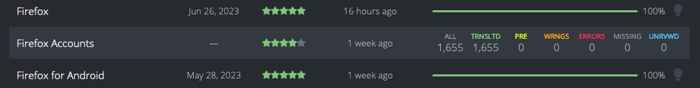
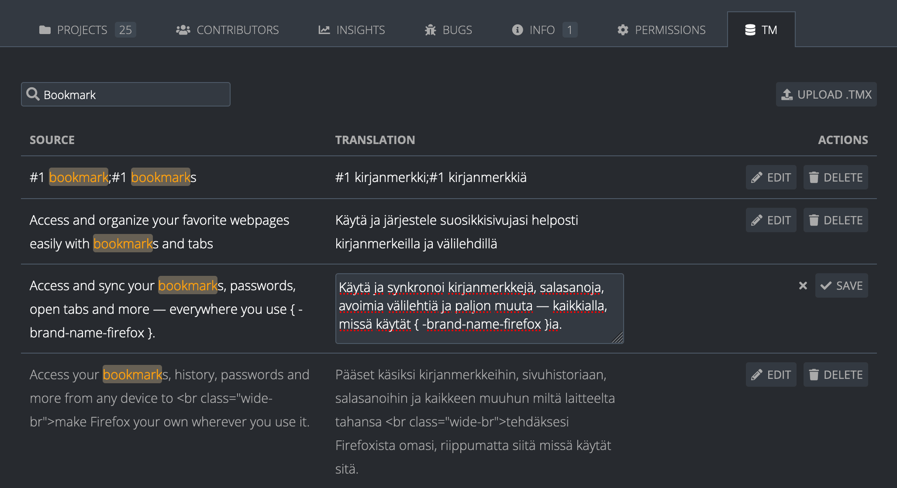

# Team and project pages

<!-- toc -->

The Teams page, accessible using the `/teams` URL (e.g. [pontoon.mozilla.org/teams](https://pontoon.mozilla.org/teams/)), lists all locales that are enabled in Pontoon. From here it’s possible to access a specific [Team page](#team-page), which contains a list of all projects enabled for the requested locale. Selecting a project from the Team page leads to the so-called the [Localization page](#localization-page).

From each locale’s Team page it’s also possible to [Request a project](#requesting-a-project) or [Request pretranslation](#requesting-pretranslation). Note that this is a request to add the locale to a project already available in Pontoon, it can’t be used for requesting a brand new project.

The Projects page, accessible using the `/projects` URL (e.g. [pontoon.mozilla.org/projects](https://pontoon.mozilla.org/projects/)), lists all projects that are available in Pontoon. From here it’s possible to access a [Project page](#project-page), which shows all locales that are enabled for the requested project. Selecting a locale in the Project page leads to the [Localization page](#localization-page).

There is also a special Localization page that allows access to all resources for all projects enabled for a specific locale: `/locale/all-projects/all-resources`.

The following diagram shows how these pages are organized and connected to each other:

## Teams

### Teams page

The Teams page lists all locales that are enabled in Pontoon. It can be reached by clicking `Teams` in the page header (not displayed when translating a project) or by using the `/teams` URL (e.g. [pontoon.mozilla.org/teams](https://pontoon.mozilla.org/teams/)). Clicking on a specific locale will open the locale’s [Team page](#team-page).

### Team page

Access a specific team’s page by selecting it from the Teams page or by appending a locale code to the end of the Pontoon base URL with `/{LOCALE}` (e.g [pontoon.mozilla.org/it](https://pontoon.mozilla.org/it) for Italian).

The page header contains linguistic information about the current locale (plural form, writing direction, etc.), plus an indication of the overall status of completion and statistics. The statistics displayed in the rightmost column are active links to access the [translation workspace](translation_workspace.md) for all projects. For example, select `ALL STRINGS` to show all the strings for all projects enabled for a specific locale in Pontoon, or select `MISSING` to filter for all strings missing translations.

Underneath the header, the following tabs are available to navigate between various Team page panels:

* **Projects**: a list of all projects enabled in Pontoon for this locale.
* **Contributors**: a list of active contributors with their statistics, filterable by time (all time, last 12/6/3/1 months).
* [**Insights**](#insights-graphs): data and trends on contributor and localization activity.
* **Bugs**: a list of open bugs for the locale, retrieved from [Bugzilla](https://bugzilla.mozilla.org/) (available in Mozilla's deployment).
* **Info**: information about the team. Team managers can edit this by clicking on the `EDIT` button.
* **Permissions**: [permissions management panel](users.md#managing-permissions) (available to [Team Managers](users.md#user-roles)).
* **TM**: [translation memory management](#translation-memory-management) panel (available to [Translators](users.md#user-roles) and [Team Managers](users.md#user-roles)).

By default, the Projects tab opens, showing a list of all projects enabled for the locale. Clicking on one of these projects leads to the [Localization page](#localization-page). Column headers can be used to sort the list of projects. For example, clicking on `Priority` will sort projects by their priority.

Hovering a project in the Projects list will replace the progress bar with a set of detailed statistics (untranslated strings, missing strings, etc.). Note that all these numbers are links, use them to open the project with a filter already enabled, for example to display only missing strings. Clicking `ALL` accesses All Resources (i.e. all strings in all files) for this project.

The rightmost column in the table will display a blue lightbulb icon if there are unreviewed translations. Note: clicking the lightbulb icon in the table header can be used to sort projects based on the number of unreviewed translations.

### Requesting a project

It’s possible to request a project from a Team page. Note that this is a request to add the locale to a project already available in Pontoon, it can’t be used for requesting a brand new project.

The button is hidden if all available projects are already enabled for the locale.

Click on `REQUEST MORE PROJECTS`, select the projects to add and then click `REQUEST NEW PROJECT` (at least one project needs to be selected for the button to be displayed).

An email will be sent to Pontoon’s administrators, and the Project manager in charge of the project will act on the request. Please note that:
* Some projects have a closed list of supported locales, meaning that these projects can’t be requested on Pontoon.
* Some projects can be requested but may not be enabled for practical restrictions related to the project itself (e.g. lack of support for the locale in iOS).

### Requesting pretranslation

For [locales supported by Google AutoML Translation](https://cloud.google.com/translate/automl/docs/languages), it’s possible to request to enable [pretranslation](glossary.md#pretranslation) for specific projects from a Team page.

The button is only displayed to translators and team managers for the locale.

Click on `REQUEST PRETRANSLATION`, select the projects to add and then click `REQUEST PRETRANSLATION` (at least one project needs to be selected for the button to be displayed).

An email will be sent to Pontoon’s administrators, and they will act on the request. Please note that:
* If a locale doesn’t have pretranslation enabled for any projects yet, it’s necessary to set up and train a new custom model, and this operation requires several hours.
* For `pontoon.mozilla.org`, each request will be evaluated against specific [opt-in guidelines](https://mozilla-l10n.github.io/documentation/tools/pontoon/managing_pretranslation.html#opt-in-guidelines-to-enable-new-locales).

### Translation memory management

The TM ([translation memory](glossary.md#translation-memory)) tab lists all TM entries for the team. A source string and translation are provided for each entry, which upon clicking leads to the [translation workspace](translation_workspace.md) for the corresponding strings. Entries are only shown once for each unique combination of source string and translation. TM entries can be searched by source string or translation using the `Search` field.

The following actions are available:
* **Edit**: after clicking the `Edit` button in the Actions column, the translation of the TM entry transforms into a textarea element and becomes editable. Next to it, `Save` and `Cancel` buttons appear. Clicking `Save` saves any changes to all corresponding TM entries and clicking `Cancel` cancels the editing action.
* **Delete**: after clicking the `Delete` button in the Actions column, the button changes into the `Delete N TM entries?` confirmation button (with N representing the number of corresponding TM entries). Clicking that button deletes all corresponding TM entries and clicking `Cancel` cancels the editing action.
* **Upload .TMX**: after clicking the `Upload .TMX` button above the TM entry list, an Open file dialog pops up. The user then selects the [TMX file](glossary.md#translation-memory) to upload, the TM entries from the file start to import into the team's TM, and eventually a success or error message appears.

## Projects

### Projects page

The Projects page lists all projects that are available in Pontoon. It can be reached by clicking `Projects` in the page header (not displayed when translating a project) or by using the `/projects` URL (e.g. [pontoon.mozilla.org/projects](https://pontoon.mozilla.org/teams/)). Clicking on a specific [Project page](#project-page) will open the project’s [Project page](#project-page).

### Project page

Access a project’s page by selecting it from the Projects page (e.g. [pontoon.mozilla.org/projects](https://pontoon.mozilla.org/projects/)).

The page header contains useful information about the current project:
* **Priority**: priority from 5 stars (highest) to 1 star (lowest).
* **Target date**: set only for some projects, it indicates when the translation is due.
* **Repository**: link to the repository storing translations for this project.
* **Resources**: links to useful external resources (e.g. testing instructions, screenshots, etc.). Project managers can set up custom links for each project.
* **Project manager**: point of contact for this project.

It also includes an indication of the overall status of completion and statistics across all enabled languages.

Underneath the header, the following tabs are available to navigate between various Team page panels:

* **Teams**: a list of all locales enabled in Pontoon for this project.
* **Tags**: a list of tags defined for this project. This tab will be visible only in projects where tags are enabled. For more information about tags, see [this page]translation_workspace.md#tags).
* **Contributors**: a list of active contributors with their statistics, filterable by time (all time, last 12/6/3/1 months).
* [**Insights**](#insights-graphs): data and trends on contributor and localization activity.
* **Info**: information about the project.
* **Notifications**: contains functionality to notify those who have contributed to this project for defined locales.

By default, the Teams tab opens, showing a list of all locales enabled for the project. Clicking on one of these locales leads to the [Localization page](#localization-page).

### Requesting a locale

It’s possible to request an additional locale for some projects from its Project page.

Click on `REQUEST NEW LANGUAGE`, select the locale to add and then click `REQUEST NEW LANGUAGE`.

An email will be sent to Pontoon’s administrators, and the Project manager in charge of the project will act on the request. The same restrictions described in the [Requesting a project](#requesting-a-project) section apply here.

## Localization page

Access a project’s Localization page in two ways:
* By selecting it from the [Team page](#team-page).
* By selecting it from the [Project page](#project-page).

The page header contains useful information about the current project (same as the [Project page](#project-page)).

Underneath the header, the following tabs are available to navigate between various Team page panels:

* **Resources**: files available in the project.
* **Tags**: a list of tags defined for this project. This tab will be visible only in projects where tags are enabled. For more information about tags, see [this page](translation_workspace.md#tags).
* **Contributors**: a list of active contributors with their statistics, filterable by time. Unlike the tab available in the Team page, this only includes contributions to localization of the project for the current locale.
* [**Insights**](#insights-graphs): data and trends on contributor and localization activity.
* **Project info**: same content as the Info tab in the Project page.
* **Team info**: same content as the Info tab in the Team page.

## Insights graphs

The Insights tab, accessible from either the Project, Team, or Localization page, displays data and trends on contributor and localization activity in a graphical format.

The following insights appear on all pages:
* **Review activity**: shows the number of unreviewed suggestions as a trend line. The Team page also shows the number of peer-approved, self-approved, and rejected suggestions for each month as a bar graph to display the impact of the review process on the number of unreviewed suggestions. New suggestions (hidden by default) can also be shown by clicking `New suggestions` at the bottom of the graph. Hover over a data point to get the detailed number of strings and percentages for that month.
* **Translation activity**: shows the translation completion percentage for the locale as a trend line. The Team page also shows the number of human translations and [machinery translations](translation_workspace.md#machinery) for each month as a bar graph to display the impact of the translation process on the number of completed translations. New source strings (hidden by default) can also be shown by clicking `New source strings` at the bottom of the graph. Hover over a data point to get the detailed number of strings and percentages for that month.

The following insights only appear on Team pages:
* **Active users**: shows the ratio of active versus total for each [user role](users.md#user-roles): managers (Team managers), reviewers (Team managers and Translators), and contributors, filterable by time period (last 12/6/3/1 months).
* **Time to review suggestions**: shows the average age of [suggestions](glossary.md#translation) reviewed for a particular month, and the 12 month average. Hover over a data point in the graph to see the exact age in days for that month’s current and 12 month average.
* **Age of unreviewed suggestions**: this can be accessed by clicking `Age of unreviewed` on the bottom of the Time to review suggestions graph. Shows the average age of unreviewed suggestions at a particular point in time. Hover over a data point in the graph to see the exact age in days for unreviewed suggestions for that month.

Note: clicking on the `i` icon in the top right of each insight will provide detailed definitions for the data shown.
