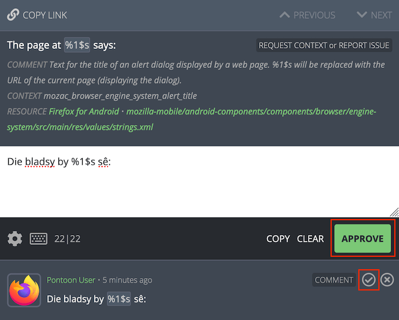

# How to translate

This document describes briefly how to translate and review strings in Pontoon and provides an [example of translation workflow within a team](#workflow-example). The documentation also includes a dedicated page about Pontoon’s [translation workspace](workspace.md), including [translation tools](workspace.md#translation-tools-and-comments).

## Translating strings

When a string is selected in the sidebar, users can input a translation using the editor available in the middle of the page. Note that, if the string already has a [translation](glossary.md#translation), the editor will be pre-populated with text that the user can modify.

Depending on the current [translation mode](glossary.md#translation-mode), the UI will look slightly different.

When the user is in *Suggestion Mode* — [manually selected](#manually-switch-to-suggestion-mode), or because the user doesn’t have permissions to submit translations directly — a blue `SUGGEST` button will be displayed in the lower-right side of the editing space.


To suggest a translation, the user can input the text in the editor and click `SUGGEST`. The suggestion will then be displayed below the editing space and in the sidebar where, in the case of multiple suggestions, only the most recent one will be displayed.

Note that a suggestion exists only in the Pontoon database, and it’s not added to the [translation memory](glossary.md#translation-memory). For projects using [version control systems](glossary.md#version-control-system), the translation is not stored in localized files outside of Pontoon.

When the user is in *Translation Mode*, a green `SAVE` button will be displayed instead of `SUBMIT`. When saving a translation:
* The translation will be displayed directly below the editing space and in the sidebar.
* The translation will be stored in the version control system (where applicable).
* All pending suggestions or [pretranslations](glossary.md#pretranslation) will be rejected.

### Manually switch to suggestion mode

Even if the user has permissions to add translations directly, submitting suggestions to be reviewed by another person helps ensure quality. To manually switch to *Suggestion Mode*, click the settings icon in the lower-left side of the editing space and select `Make suggestions`. The `SUGGEST` button will be displayed in the lower-right side of the editing space, replacing the green `SAVE` button.


To switch back to *Translation Mode*, click the settings icon again and turn off `Make suggestions`.

## Reviewing strings

To review a suggestion or pretranslation, [search](search_filters.md) for unreviewed or pretranslated strings in the sidebar.

If the current translation is acceptable, either click on the `APPROVE` button in the lower-right side of the editing space, or click on the approve icon to the right of the text. This will transform the suggestion or pretranslation into an approved translation. In the case of suggestions, the approved translation will also be stored in the version control system (where applicable).



If the current translation is **not** acceptable, it can be rejected by clicking the reject icon to the right of the suggestion. After rejecting a suggestion or pretranslation, it’s also possible to delete it completely by clicking the trashcan icon. In the case of pretranslations, the rejected text will be also removed from version control systems (where applicable).

Alternatively, it’s possible to provide a different suggestion: turn on `Make suggestions`, edit the translation as appropriate, and click `SUGGEST`. This will add the translation as a new suggested string.

## Quality checks

When submitting a translation or suggestion, Pontoon performs automated quality checks. They are meant to help localizers identify issues with punctuation, capitalization, variables, etc. before translations are saved. Failures for these checks are stored in the database, and it’s possible to filter strings with issues from the search bar.

There are two types of quality check failures: errors and warnings.

### Errors

Errors cover critical issues that would cause the string to be removed from products. For this reason, errors cannot be bypassed by localizers - the button to submit a translation is removed and the error needs to be fixed before the translation can be saved.

Examples include exceeding the maximum string length, incorrect syntax, etc. Errors are denoted with a circled X with red background.


### Warnings

Warnings are displayed when potential issues are detected in the string, but it’s not certain that they will create problems in products (unlike errors). For that reason, warnings can be bypassed by localizers, allowing them to save a translation anyway.

Examples include missing punctuation, differences in number of sentences and capitalization, etc. Warnings are denoted with a circled X with gray background.


Certain types of checks reported by the Translate Toolkit library may result in many false positives. For this reason, they can be [completely disabled](users.md#editor-settings).

## Performing batch actions on strings

Mass actions can be performed on multiple strings at once by clicking on the square to the left of any string in the sidebar. When clicked, the square will show a checkmark and the editing space will show the mass action panel. Note that mass actions are only available to users with [translator permissions](users.md#user-roles).


To select a range of strings, select the first one and hold `SHIFT`, then select the last one. To select all strings, click `SELECT ALL` on the top-right of the mass action panel. The number of selected strings will appear on the top-left, next to the Exit icon.

To return back to the default editing space, click the Exit icon on the top-right of the mass action panel.

In the `REVIEW TRANSLATIONS` section, the user can approve or reject suggestions for all selected strings. Upon clicking `APPROVE ALL` or `REJECT ALL SUGGESTIONS`, the label of the button will be replaced with the number of affected translations.
Note that `APPROVE ALL` accepts the latest suggestion, but doesn’t reject other suggestions if available.

In the `FIND & REPLACE IN TRANSLATIONS` section, the user can input the text to search for, and the text to replace it with. This is a basic find and replace feature that will work only on the selected strings.

## Downloading and uploading translations

Pontoon provides the ability to download and upload translations, including [terminology](glossary.md#terminology) and [translation memories](glossary.md#translation-memory). To access these features, click on the profile icon in the top-right corner of any page. Note that the user must be in the translation workspace for the download/upload options to be displayed in the dropdown menu.


Anyone can download terminology (`.tbx`), translation memory (`.tmx`) and translations, while only users with translator permissions can upload translations. When downloading translations:
* The resource currently selected is downloaded in its original format, it’s not converted in any way.
* If the project contains multiple files, a ZIP of all files is downloaded. If the project contains more than 10 files, only the file currently translated will be downloaded.

When uploading translations to Pontoon:
* Translations different from the ones in Pontoon will be imported and attributed to the user uploading the file.
* Translations matching the ones in Pontoon will be ignored.

## Downloading .tbx and .tmx files via command line

Terminology (`.tbx`) and translation memory (`.tmx`) files can grow big in size over time. To download files via command line it is advised to use `curl` command with the `--compressed` flag, to reduce download times and avoid request timeouts.

Here’s an example command to download German (de) .tmx file across all projects from `pontoon.mozilla.org`:

```
curl -o de.all-projects.tmx --compressed https://pontoon.mozilla.org/translation-memory/de.all-projects.tmx
```

Note that Terminology files can be downloaded in the `TBX 2008 (v2)` format in addition to the default `TBX v3` format available via the profile menu.

Here’s an example command to download German (de) .tbx file in the `TBX 2008 (v2)` format from `pontoon.mozilla.org`:

```
curl -o de.v2.tbx --compressed https://pontoon.mozilla.org/terminology/de.v2.tbx
```

## Workflow example

This workflow utilizes the full power of Pontoon’s online translation features. It assumes that at least two translators are available for the project (*AB workflow*); however, this workflow can be completed by a single translator performing each phase (*AA workflow*), or by multiple translators in an *ABC<sub>n</sub> workflow* repeating Phase 3.

### Phase 1: translation

#### Translator A

1. Log in to Pontoon.
2. Browse to the [project](teams_projects.md).
3. Using [filters](search_filters.md) select `Missing` to display only the strings currently missing a translation, marked as [fuzzy](glossary.md#fuzzy) or containing errors.
4. Access personal settings by clicking on the gear icon below the editing field and turn on `Make suggestions`.<br>Note that new contributors who have not yet been granted [Translator permissions](users.md#user-roles) will only have the ability to `Make suggestions`, which will be enabled by default.
5. For each string, type a translation and save it with the blue `SUGGEST` button. The string will be stored and displayed under the editor. Each translation submitted shows the name of the author and when it was saved.
    * If something is unclear or there is a question about the source string, use the [REQUEST CONTEXT or REPORT ISSUE](ui.html#source-string) feature to ask the [Project manager](users.md#user-roles).

General notes:
* Rely on Pontoon’s [translation tools](ui.md/#translation-tools-and-comments) to ensure consistency and make the translation process faster.
* When using Firefox, make sure to have a [dictionary](https://addons.mozilla.org/firefox/dictionaries/) installed for the translation language, and that spell checking is enabled in the translation text area.

### Phase 2: review suggestions

#### Translator B

1. Log in to Pontoon.
2. Browse to the [project](teams_projects.md).
3. In [filters](search_filters.md) select `Unreviewed`, to isolate the strings previously suggested by another translator.
4. Review the suggested strings.
     * If a suggestion is acceptable:
        * Confirm it as an approved translation by clicking the green `SAVE` button or the checkmark icon near the string in the list below the editor (it turns green when hovered).
     * If a suggestion is not acceptable:
        * Switch to [Suggest mode](translate.md). Edit the translation in the editing space and click the blue `SUGGEST` button. The newly suggested version will **not** overwrite the translator’s work, but instead will appear at the top of the list under the editor.
     * Use [translation comments](glossary.md#comment) to discuss a translation with the other translator. For example, discussing possible alternate translations or asking questions when something isn’t clear.

### Phase 3: implementing QA

#### Translator A

1. In the project, select `Unreviewed` from the filter search. Then compare the initial entries with those of the reviewer for changes.
2. Review the remaining strings:
    * If in agreement, confirm the reviewer’s version by clicking the green `SAVE` button or the checkmark icon near the string in the list below the editor (it turns green when hovered).
    * If suggesting an alternative, type it into the editor, then hit the blue `SUGGEST` button. Then resubmit it to the reviewer from Phase 2.
    * Reject suggestions not considered suitable by clicking on the cross icon near the string (it turns red when hovered).
    * If Translator A does not have the Translator or Team manager role, they will be unable to confirm or reject a suggestion. In that case, use [translation comments](glossary.md#comment) to discuss the translation with the reviewer.

Repeat, switching translators, until a consensus is reached.
