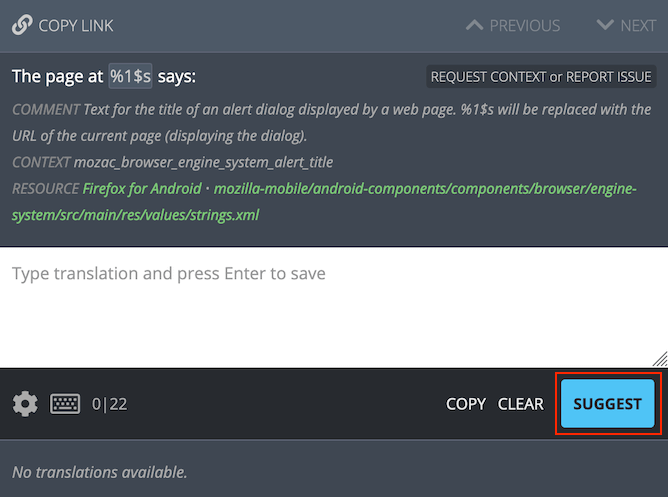
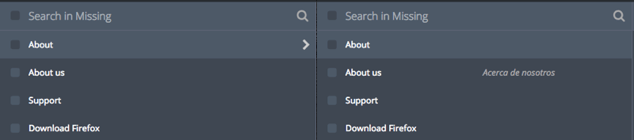
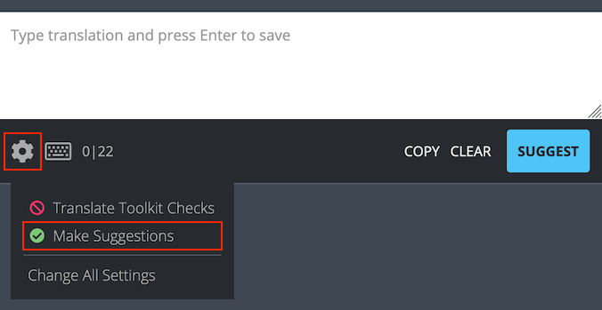
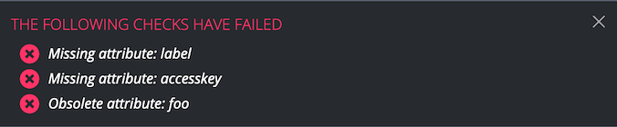
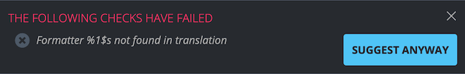
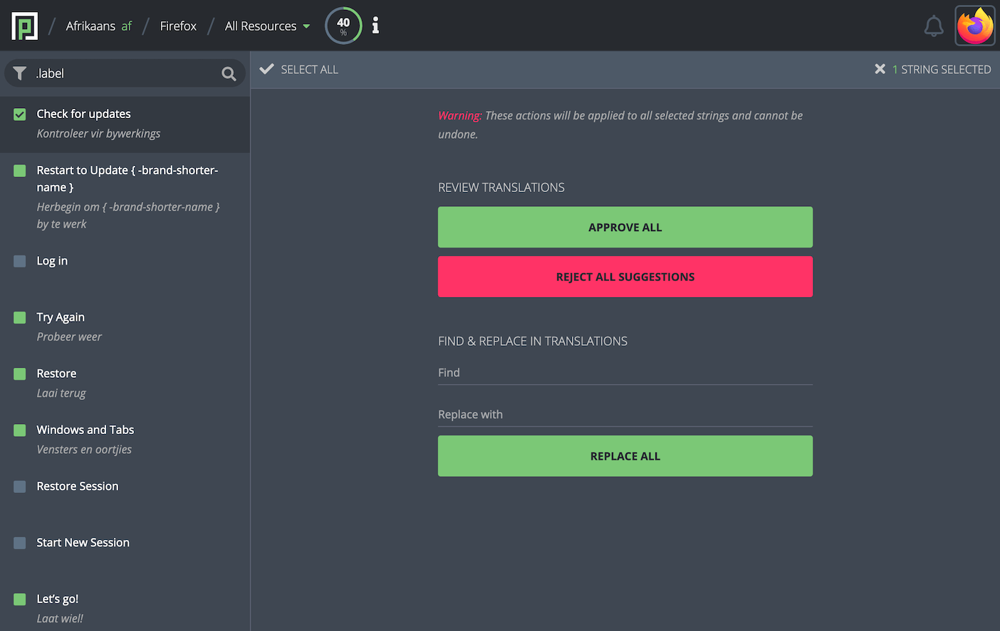
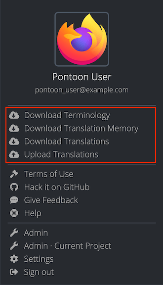

# How to translate

## Translating strings

Four actions can be performed on strings: submit a suggestion, review a suggestion/pretranslation, delete a rejected suggestion/pretranslation, and submit a translation directly. Availability of these actions depends on the user’s [role](users.md#user-roles).

This document is a summary to demonstrate the different translation modes available in Pontoon. This documentation includes specific pages for learning how to use Pontoon’s [interface](ui.md) and [translation resources](resources.md).

### Submit a suggestion

When the user is in *Suggest Mode*, or doesn’t have permissions to submit translations directly, a blue `SUGGEST` button will be displayed in the lower-right side of the editing space.



To suggest a translation, the user can input the translation in the editing space and click `SUGGEST`. The suggestion will then be displayed below the editing space and in the sidebar (in case of multiple suggestions, the most recent suggestion will be displayed).



Note that a suggested translation exists only in the Pontoon database, not in the repository or translation memories.

#### Manually switch to suggestion mode

Even if the user has permissions to add translations directly, submitting suggestions to be reviewed by another person helps ensure quality. To manually switch to *Suggestion Mode*, click the settings gear in the lower-left side of the editing space and click on `Make Suggestions`, so that the icon changes from a prohibition sign to a green checkmark. The `SUGGEST` button will be displayed in the lower-right side of the editing space, replacing the green `SAVE` button.



To switch back to *Translation Mode*, click the gear icon again and turn off `Make Suggestions`.

### Review a suggestion

To review a suggestion, [search](search_filters.md) for unreviewed strings in the sidebar.

If the suggestion is acceptable, either click on the `SAVE` button in the lower-right side of the editing space, or click on the checkmark icon to the right of the suggestion (it switches from gray to green when hovered). This will transform the suggested string into an approved translation, save the string to the database and to the repository on the next sync cycle.

If the suggested string is **not** an acceptable translation, it can be rejected by clicking the cross icon to the right of the suggestion (it becomes red when hovered). After rejecting a suggestion, it’s also possible to delete it completely by clicking the trashcan icon. Note that submitting a translation directly through the editing space will automatically reject all pending suggestions.

Alternatively, it’s possible to provide a different suggestion: turn on `Make Suggestions`, edit the suggested string as appropriate, and click `SUGGEST`. This will add the translation as a new suggested string in the Pontoon database but will not save the string in the repository.

### Submit a translation directly

Note that it is always best practice to have a translation reviewed by another person; however, if no reviewer is available, these instructions allow a user to translate without review.

To submit a translation directly, search for untranslated strings and click on any of them.

Ensure that the `Make Suggestions` option in settings is disabled, then input the translation to the editing space and click `SAVE`. This will save the translation directly, without review, to the repository.

## Quality checks

When submitting a translation or suggestion, Pontoon performs automated quality checks. They are meant to help localizers identify issues with punctuation, capitalization, variables, etc. before translations are saved. Failures for these checks are stored in the database, and it’s possible to filter strings with issues from the search bar.

There are two types of quality check failures: errors and warnings.

### Errors

Errors cover issues that would cause the string to be ignored, for example removed from Firefox builds. For this reason, errors cannot be bypassed by localizers - the button to submit a translation is removed and the error needs to be fixed before the translation can be saved.

Examples include exceeding the maximum string length, incorrect Fluent syntax, etc. Errors are denoted with a circled X with red background.



Errors are detected using the [compare-locales library](https://pypi.org/project/compare-locales/) and Pontoon’s internal checks.

### Warnings

Warnings, unlike errors, are displayed when potential issues are detected in the string, but there’s a risk they might be false positives. For that reason, warnings can be bypassed by localizers, allowing them to save a translation anyway.

Examples include missing punctuation, differences in number of sentences and capitalization, etc. Warnings are denoted a circled X with gray background.



Warnings are detected using the [compare-locales library](https://pypi.org/project/compare-locales/) and [Translate Toolkit libraries](http://docs.translatehouse.org/projects/translate-toolkit/en/latest/).

Note: since Translate Toolkit checks may result in many false positives, they can be [completely disabled](users.md#user-settings).

### Performing batch actions on strings

It’s possible to perform mass actions on batches of strings by clicking on the square to the left of any string in the sidebar. When clicked, the square will show a checkmark and the editing space will show the mass action window.



After selecting a string, it’s possible to hold `SHIFT` and click on another string to select a range of strings.

At the top-left of the mass action column, the user can return to the editing space by clicking on the `X` icon. To the right of the exit icon, the number of strings currently selected is displayed. At the top-right of the mass action window, it”s possible to select all the strings in the sidebar.

In the `REVIEW TRANSLATIONS` section, the user can approve suggestions or reject suggestions for all selected strings. Upon clicking `APPROVE ALL` or `REMOVE ALL SUGGESTIONS`, the label of the button will be replaced with the number of affected translations.
Note that `APPROVE ALL` accepts the latest suggestion, but doesn't reject other suggestions if available.

In the `REPLACE IN TRANSLATIONS` section, the user can input the text to search for, and the text to use as a replacement. This is a basic find and replace feature that will work only on the selected strings.

Note that mass actions are only available to users with [translator rights](users.md#user-roles).

## Downloading and uploading translations

Pontoon provides the ability to download and upload translations, including terminology and translation memories. To access these features, click on the user icon in the top-right section of Pontoon. Note that the user must be in the translation workspace for the download/upload options to be displayed in the dropdown menu.



Anyone can download terminology (`.tbx`), translation memory (`.tmx`) and translations, while only translators can upload translations. When downloading translations:
* The resource currently selected is downloaded in its original format, it’s not converted in any way.
* If the project contains multiple files, a ZIP of all files is downloaded. If the project contains more than 10 files, only the file currently translated will be downloaded.

When uploading translations to Pontoon:
* Existing strings with matching translations will be ignored.
* New strings and new translations will be imported and attributed to the user uploading the file.

## Downloading .tbx and .tmx files via command line

Terminology (`.tbx`) and translation memory (`.tmx`) files can grow big in size over time. To download files via command line it is advised to use `curl` command with the `--compressed` flag, to reduce download times and avoid request timeouts.

Here’s an example command to download German (de) .tmx file across all projects:

```
curl -o de.all-projects.tmx --compressed https://pontoon.mozilla.org/translation-memory/de.all-projects.tmx
```

Note that Terminology files can be downloaded in the `TBX 2008 (v2)` format in addition to the default `TBX v3` format available via the profile menu.

Here’s an example command to download German (de) .tbx file in the `TBX 2008 (v2)` format:

```
curl -o de.v2.tbx --compressed https://pontoon.mozilla.org/terminology/de.v2.tbx
```
