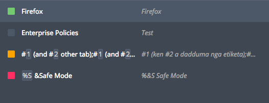
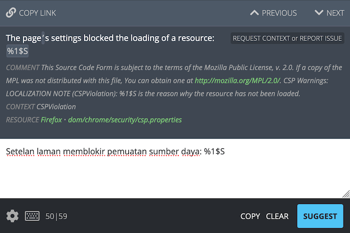

# Understanding Pontoon user interface

<!-- toc -->

## Pontoon translation workspace

Pontoon’s translation workspace is organized in 3 columns:
* The left columns includes a list of strings with a search field at the top.
* The main editing space is located in the middle column.
* The right column includes information about terminology, source string comments, suggestions from translation memory, machine translation, and other locales.

### Main toolbar

The main toolbar allows users to navigate to the dashboards or to change the current resource.

Clicking the locale name will open the [Team page](teams_projects.md#team-page) for that locale, while clicking the project name will open the [Localization page](teams_projects.md#localization-page) for that project.

Clicking on the current resource (or `All Resources`) will display a list of all resources available for that project. It’s possible to search for a resource, and click one to load only the entities included in it. Clicking `All Resources` at the bottom of the list will go back to display all resources, while `All Projects` will show entities for all projects under the selected locale.

A pie chart showing the translation status of the current resource is located to the right of the resource name. A more detailed breakdown is displayed when clicking the chart.

When clicked, the information icon located to the right of the pie chart provides information regarding the project, its priority level, and testing.

The notifications icon, represented by a bell, is located on the right side of the main toolbar. By clicking the bell icon, users can view a list of the latest [notifications](notifications.md) they received..

The profile menu is located at the far right of the main toolbar. Clicking the profile image will reveal a dropdown menu where users can perform several actions, like navigate to their [profile page](profile.md), [download and upload translations](translate.md#downloading-and-uploading-translations), etc.

Note that some profile menu items are only available to users with specific [permissions](users.md#user-roles).

### String list and filters

The sidebar displays the list of strings in the current project resource. For each string there is:
* A colored square that identifies the string status (i.e. *Missing*, *Translated*, etc.).
* The source string.
* The approved translation or the most recent suggestion if available.

Color legend:
* **green**: string is translated.
* **light-green**: string is pretranslated.
* **orange**: string has warnings.
* **red**: string has errors.
* **gray**: string is missing.

At the top of the sidebar, the user can access Pontoon’s [search and string filters](search_filters.md).

When a string is selected in the sidebar, a small icon with 4 arrows is displayed near the checkbox: this can be used to show strings that surround the selected string in the [resource](glossary.md#resource), bypassing the current filter. This is often helpful to provide more context for the localization, especially when translating missing strings.

### Translation workspace

The translation workspace is where the translation takes place.

It’s possible to navigate sequentially through the strings by clicking the `PREVIOUS` or `NEXT` buttons located at the top of the workspace, or by using keyboard shortcuts (`ALT` + arrow down or up). The `COPY LINK` button copies in the clipboard a link to the current string.

Above the editor, the user can view the source string, any comments regarding the string, and the resource path where the string is located.
In the same area, the `REQUEST CONTEXT or REPORT ISSUE` button can be used to request more information about the current string: it will focus the [COMMENTS section](##source-string-comments), and mention the project manager for the project.

The editor is located in the middle section of the column, and it’s where users can input or edit their translations.

In the lower-right side of the workspace, it’s possible to `COPY` the source string to the editor, `CLEAR` the area where translations are typed, and `SUGGEST` or `SAVE` the translation by clicking the corresponding button. This area is also used to [display warnings and errors](translate.md#quality-checks) when submitting a translation.

In the lower-left side:
* Clicking the gear icon allows users to toggle `Translation Toolkit checks` or `Make suggestions`, and navigate to the user settings.
* Clicking the keyboard icon displays a list of available shortcuts.
* The numbers displayed to the right of the keyboard icon (e.g. `50|59`) are the number of characters in the source and target string.

Note that access to some settings is restricted by [user permissions](users.md#user-roles).

The space below the editor displays the list of suggestions or translations for the current string.

In this case, the first item is the approved translation (green checkmark), while the other 2 are rejected suggestions. By clicking the `COMMENT` button it’s possible to add a **translation comment** to this specific translation. To mention another user in the comment, start typing `@` followed by their name.

If there is already a comment associated with a string, the button will display the number of comments (e.g. `1 COMMENT` for the first rejected suggestion).

#### Read-only projects

A project could be enabled in *read-only* mode for some locales: their translations will be available to other languages in the `LOCALES` tab, but it won’t be possible to change or submit translations directly in Pontoon. In this case, a note is displayed in the bar below the editor, and all other controls are hidden.

#### Fluent - FTL files

When working on FTL (Fluent) files, the editing space will look slightly different.

In the example above, the string has a `value` and an attribute `title`. Both are displayed in the source section (highlighted in red), and available as separate input fields in the editor (highlighted in orange).

The following image is an example of a string with plurals: while English only has 2 forms, plural and singular, other locales can have a different number of plural forms. In this case, Russian has 3 forms (highlighted in orange).

In the bottom left corner, the FTL button (highlighted in yellow) allows to switch between the standard UI (*Simple FTL mode*) and the *Advanced FTL mode*, where it’s possible to edit the original syntax directly, as you would in a text editor. For details on the Fluent syntax, see [Fluent for localizers](../fluent/).

Note that the FTL button’s text is green when in *Advanced FTL mode*.

### Translation tools and comments

Built-in translation tools are located in the rightmost column. For more information about `MACHINERY`, and `LOCALES`, see the page dedicated to [Pontoon’s translation resources](resources.md).

#### Terminogy

The `TERMS` tab shows the definition for a term, in case the source string includes matches with the built-in [terminology](glossary.md#terminology). The matching term is also highlighted in the source string.

#### Source string comments

The `COMMENTS` tab is used to display existing **source string comments**, or add new ones. Source string comments, unlike translation comments, are associated with the string: it’s possible to have a comment in this section even if the string doesn’t have any suggestion or translation yet.

They’re designed for team member to have a conversation about the source string, for example to clarify its meaning, or to get more information from project managers.
