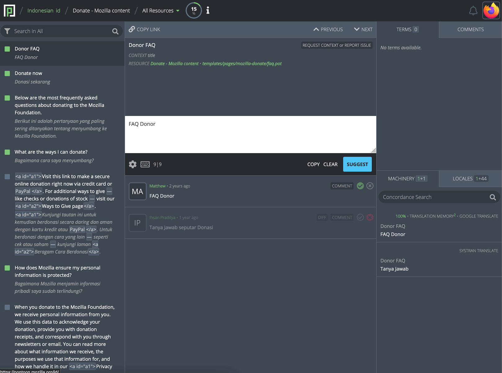
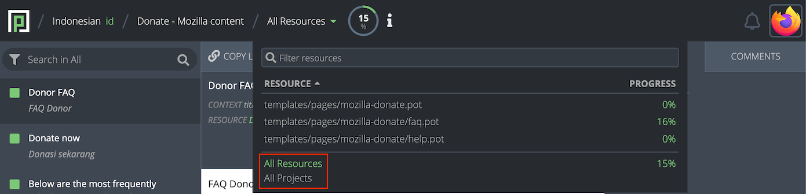
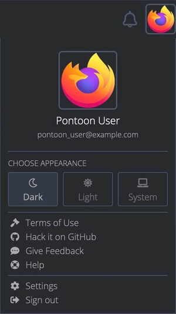
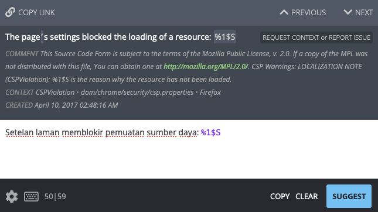
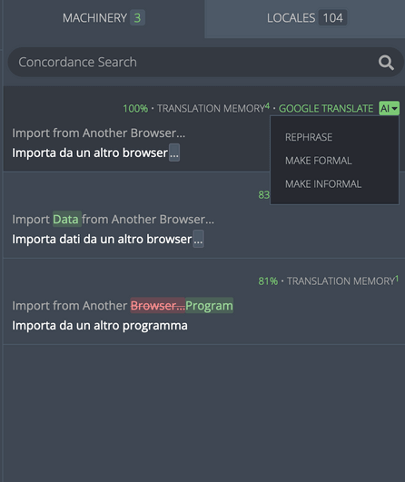
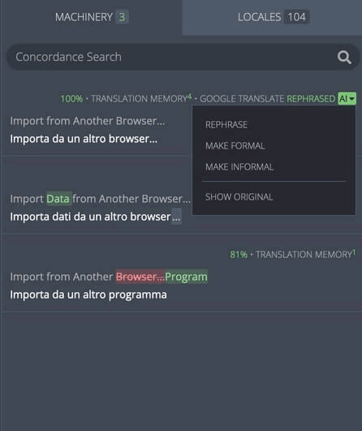
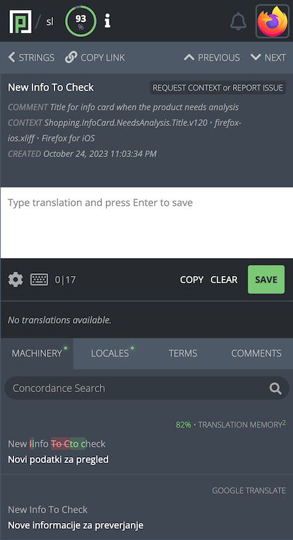

# Understanding Pontoon’s translation workspace

<!-- toc -->

Pontoon’s translation workspace consists of the main toolbar and 3 columns:
* The left column contains the string list for the current resource with a search field at the top.
* The middle column contains the main editing space.
* The right column contains terminology, source string comments, suggestions from translation memory, machine translation, and translations from other locales.

## Main toolbar

The main toolbar at the top of the page allows users to navigate to the dashboards or to change the current resource.

Clicking the locale name will open the [Team page](teams_projects.md#team-page) for that locale, while clicking the project name will open the [Localization page](teams_projects.md#localization-page) for that project.

Clicking on the current resource (or `All Resources`) will display a list of all resources available for that project. It’s possible to search for a resource, and click one to load only the entities included in it. Clicking `All Resources` at the bottom of the list will go back to display all resources, while `All Projects` will show entities for all projects under the selected locale.

A progress chart showing the translation status of the current resource is located to the right of the resource name. A more detailed breakdown is displayed when clicking the chart.

The notifications icon, represented by a bell, is located on the right side of the main toolbar. By clicking the bell icon, users can view a list of the latest [notifications](notifications.md) they received.

The profile menu is located at the far right of the main toolbar. Clicking the profile image will reveal a dropdown menu where users can perform several actions, like navigate to their [profile page](profile.md), [download and upload translations](translate.md#downloading-and-uploading-translations), change their theme, etc.

Note that some profile menu items are only available to users with specific [permissions](users.md#user-roles).

A selector to change the current theme is available in the profile menu and in the [settings page](users.md#appearance). There are three theme options available:

* Light.
* Dark.
* Match system (aligns with the theme used by the operating system).

To change the theme, select the button corresponding to your preferred theme. The change will take effect immediately.

## String list and filters

The left column displays the list of strings in the current project resource. Each string is represented by:
* A colored square that identifies the string [status](search_filters.md#translation-status) (i.e. *Missing*, *Translated*, etc.).
* The source string.
* The approved translation or the most recent suggestion if available.

Color legend:
* **gray**: translation is missing.
* **green**: string is translated.
* **light-green**: string is pretranslated.
* **orange**: translation has warnings.
* **red**: translation has errors.

When a string is selected in the sidebar, a small icon with four arrows is displayed near the checkbox: this can be used to show strings that surround the selected string in the [resource](glossary.md#resource), bypassing the current filter. This is often helpful to provide more context for the localization, especially when translating missing strings.

At the top of the sidebar, the user can access Pontoon’s [search and string filters](search_filters.md).

## Main editing space

The main editing space in the middle column is where translation takes place.

### String navigation

The top of this space contains a string navigation interface. It’s possible to navigate sequentially through the strings by clicking the `PREVIOUS` or `NEXT` buttons located at the top of the editing space, or by using keyboard shortcuts (`ALT` + arrow down or up). A link to the current string can be copied to the clipboard using the `COPY LINK` button.

### Source string

Below the navigation interface, the user can view the source string, any comments present in the resource regarding the string, and the resource path where the string is located.
In the same area, the `REQUEST CONTEXT or REPORT ISSUE` button can be used to request more information about the current string: it will focus the [COMMENTS section](##source-string-comments), and mention the project manager for the project.

#### Context

Sometimes you may want to investigate more context about a particular string through an external resource such as a [Version Control System](glossary.md#version-control-system). The `CONTEXT` information provided underneath the source string shows the identifier, file, and project for the string — allowing you to find the string within the codebase of the project. For example, for some Mozilla projects these can be used to [track strings to bugs](../mercurial/tracking_back_string_to_bug.md).

### Editor

The editor is located in the middle section of the column, and it’s where users can input or edit their translations.

In the lower-right side of the editing space, it’s possible to `COPY` the source string to the editor, `CLEAR` the area where translations are typed, and `SUGGEST` or `SAVE` the translation by clicking the corresponding button. This area is also used to [display warnings and errors](translate.md#quality-checks) when submitting a translation.

In the lower-left side:
* Clicking the gear icon allows users to toggle `Translation Toolkit checks` or `Make suggestions`, and navigate to the user settings. Note that access to some settings is restricted by [user permissions](users.md#user-roles).
* Clicking the keyboard icon displays a list of available shortcuts.
* The numbers displayed to the right of the keyboard icon (e.g. `50|59`) are the number of characters in the target and source string.

#### Read-only projects

A project could be enabled in *read-only mode* for some locales: their translations will be available to other languages in the `LOCALES` tab, but it won’t be possible to change or submit translations directly in Pontoon. In this case, a note is displayed in the bar below the editor, and all other controls are hidden.

### Translation list

The space below the editor displays the list of [translations](glossary.md#translation) for the current string.

Each entry contains:
* The name of the translator and their profile picture (linking to their profile).
* How long ago the entry was submitted (hover over to see the full date and time as a tooltip).
* The translation.
* Icons indicating translation status (see below).
* [Translation comments](glossary.md#comment).

Icons to the right indicate the [status](search_filters.md#translation-status) of each translation:
* The solid green circle with checkmark indicates that the translation has been approved.
* The outlined lime green circle with checkmark indicates a pretranslation that has not yet been reviewed.
* If both icons are gray, translation has been suggested but not yet reviewed.
* The red cross indicates that the translation has been rejected. The entire element will look opaque.
* The trashcan, available only for rejected translations, can be used to completely delete a translation. Those with the contributor role can only remove their own translations, while those with a translator permissions can delete anyone’s.

In the screenshot above, the first item is the approved translation (green checkmark), while the other two are rejected suggestions.

#### Translation comments

By clicking the `COMMENT` button it’s possible to add a **translation comment** to this specific translation. To mention another user in the comment, start typing `@` followed by their name.

If there is already a comment associated with a string, the button will display the number of comments (e.g. `1 COMMENT` for the first rejected suggestion).

#### Viewing translation differences

The `DIFF` option appears if there are multiple translations for one string. Toggling `DIFF` compares the text to the current approved translation, or the most recent suggestion if no translation has been approved yet. Text highlighted in green indicates content that has been added, while strikethrough text in red indicates removed content. Toggling `DIFF` again will display the original string.

## Fluent - FTL files

When working on FTL (Fluent) files, the editing space will look slightly different.

In the example above, the string has a `value` and an attribute `title`. Both are displayed in the source section (highlighted in red), and available as separate input fields in the editor (highlighted in orange).

The following image is an example of a string with plurals: while English only has two forms, plural and singular, other locales can have a different number of plural forms. In this case, Russian has three forms (highlighted in orange).

In the bottom left corner, the FTL button (highlighted in yellow) allows to switch between the standard UI (*Simple FTL mode*) and the *Advanced FTL mode*, where it’s possible to edit the original syntax directly, as you would in a text editor. For details on the Fluent syntax, see [Fluent for localizers](../fluent/).

Note that the FTL button’s text is green when in *Advanced FTL mode*.

## Translation tools and comments

Built-in translation tools are located in the rightmost column.

### Terminology

The `TERMS` tab shows the definition and translation of a term, in case the source string includes matches with the built-in [terminology](glossary.md#terminology). The matching term is also highlighted in the source string. A popup appears on click showing the definition and translation for a term.

### Source string comments

The `COMMENTS` tab is used to display existing **source string comments**, or add new ones. Source string comments, unlike translation comments, are associated with the string: it’s possible to have a comment in this section even if the string doesn’t have any suggestion or translation yet.

They’re designed for team members to have a conversation about the source string, for example to clarify its meaning, or to get more information from project managers.

Administrators can pin or unpin a source string comment: this pinned comment will be displayed along existing comments in the editing area as `PINNED COMMENT`, and users will [receive a notification](notifications.md#comments).

The screenshot above shows a pinned comment, and the command to unpin it.

### Machinery

Machinery shows possible translations from a variety of sources. These sources include:
* [Pontoon’s internal translation memory](translate.md#downloading-and-uploading-translations).
* [Microsoft Terminology](https://www.microsoft.com/Language/).
* [Google Translate](https://translate.google.com).
* [SYSTRAN](https://www.systran.net/).
* [Caighdean](https://github.com/kscanne/caighdean).
* [Bing Translator](https://www.bing.com/translator) (not currently enabled on pontoon.mozilla.org).

In addition, the user has the ability to search for translations containing words via [`Concordance search`](#concordance-search).

In the tab, the number of entries is visible alongside the `MACHINERY` title in white. If any of the machinery matches are from translation memory, the number of matches will appear separately in green. For example, the screenshot below shows `2+1`, where the green `2` represents the two matches from translation memory and the `1` represents a machinery entry from Google Translate.

At the top of each entry, a diff view compares the current source string and the source string from the machinery entry. Strikethrough text highlighted in red indicates text that is present in the source string but not in the machinery source string, while text highlighted in green indicates text available only in the machinery source string.

To the right of the entry, the number in green shows the percent match between the machinery source string and the current source string. The higher the percentage, the more likely machinery is to be useful; a 100% match indicates that the sources for the current string and for the machinery string are identical.

The origin of the machinery entry is listed in gray above the source string. Clicking the gray text will open the origin in a new window. The green superscript to the right indicates the number of matches for the entry in the translation memory.

Be careful when using the machinery tab as suggestions may not match the source string for the project being translated. Even if the source strings match, the context in which strings are used may not be the same. This could lead to incorrect or unnatural translations. Always keep the meaning and purpose of the string being translated in mind when using the machinery tab.

#### Large language model (LLM) integration

Pontoon will show a dropdown labeled `AI` for all locales that have Google Translate available as a translation source. This feature refines the Google Translate output using an LLM. Opening this dropdown will reveal three options:
* `REPHRASE`: Generate an alternative to this translation.
* `MAKE FORMAL`: Generate a more formal version of this translation.
* `MAKE INFORMAL`: Generate a more informal version of this translation.

After selecting an option, the revised translation will replace the original suggestion. Once a new translation is generated, another option `SHOW ORIGINAL` will be available in the dropdown menu. Selecting it will revert to the original suggestion.

#### Concordance search

Concordance search allows users to search across all projects in Pontoon. Users can search for translations using strings in either source or target language. Matching results are displayed with the source string, translation, and project name; clicking a result will automatically fill the translation into the editor. Note that the search does not need to be related to the current string or project.

#### Stand-alone machinery

Pontoon machinery is also available as a [stand-alone web page](https://pontoon.mozilla.org/machinery/). Use the `Machinery` link in the main navigation to access the page (this is not accessible from the translation workspace).

To use the machinery, select the target locale from the dropdown menu to the right of the searchbar. Then input the English source string into the searchbar and press Enter. This will display all matching machinery entries. Information is organized exactly as in the translation workspace.

### Locales

The locales tab shows approved translations from Pontoon projects in other [locales](glossary.md#locale).

Next to the `LOCALES` title, the number of available entries is visible. The number for preferred locales is green, while the number for all other locales is in gray.

Users can select locales to appear at the top of their Locales tab as a preferred locale. To add a locale to the preferred locale list, access the [user settings](users.md#locale-settings) page.

Entries in the `LOCALES` tab above the green line are preferred locales. Non-preferred locales are displayed below the green line, sorted alphabetically by language name.

Each row displays the translation for the source string in the selected locale. Above each entry, the language name is visible in gray, while the locale code is displayed in green.

The `LOCALES` tab is useful for seeing what general style choices are made by other localization communities. When encountering a difficult string, a translator can use other locales as a source of inspiration.

Note that, when using the `LOCALES` tab, the translator should always opt for fluency in their own locale. Languages vary linguistically on many levels. The locales tab can be extremely useful, but should be used carefully, and rarely as the sole translation resource for translation.

## Smaller screens

The translation workspace is responsive, which means the layout will adapt to smaller screens. Everything you do on your desktop computer or laptop, you can also do on your phone or tablet: review strings, fix typos or even translate a few strings on the go.

