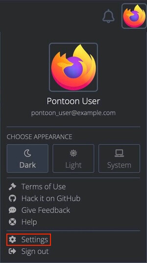

# User accounts and settings

<!-- toc -->

## Creating an account

While Pontoon can be configured to use [different login systems](https://mozilla-pontoon.readthedocs.io/en/latest/admin/deployment.html#environment-variables) (Django, GitHub, etc.), the Mozilla instance hosted at [pontoon.mozilla.org](https://pontoon.mozilla.org/) uses Firefox accounts.

To create an account, click on the `Sign In` button in the top right corner and follow the instructions.

## User settings

User settings can be accessed by:
* Clicking the user avatar in the top right corner, and selecting `Settings` from the dropdown menu.
* Opening the `/settings` URL directly (e.g. [pontoon.mozilla.org/settings](https://pontoon.mozilla.org/settings/)).
* Using the `CHANGE SETTINGS` button in the [Profile page](profile.md).

### Profile picture

The profile picture can be set or updated on [Gravatar](http://gravatar.com/) by clicking the image displayed at the top of the settings page (when hovered, the picture will display an `Update profile picture` message).

### Personal information

In this section it’s possible to update the display name and other personal information:
* `Display name`: it’s the name displayed in Pontoon, for example when submitting a translation or suggestion. It’s also used as the author name when committing translations to version control system (i.e. git or hg repositories).
* `Username`: this is currently used to generate the URL for the [Profile page](profile.md) (e.g. `https://pontoon.mozilla.org/contributors/USERNAME/`). If not provided, a hash will be used instead of the username.
* `Contact email address`: if provided, this will be displayed in the Profile page instead of the login email address.
* `Bio`: a short text that will be displayed in the Profile page.

### External accounts

In this section it’s possible to specify the username used in external accounts, like GitHub or Bugzilla. If provided, this information will be displayed in the Profile page.

### Visibility of data on the Profile page

Users can determine the visibility of fields containing personal information — like email address or external accounts — and statistics about their contribution. From the smallest audience to the largest, a field can be visible to:
* `Translators`: these are users with translator permissions in Pontoon, independently from the locale. The rationale is that translators need to have access to specific information to either contact a contributor during review, or check stats about their previous contributions.
* `Logged-in users`: these are users logged-in to Pontoon, independently from their permissions.
* `Public`: this includes all users and not logged-in visitors.

These are the available data fields:
* `Email address`: by default, this field is only visible to translators. Visibility can be expanded to all logged-in users, but it’s always hidden to visitors to reduce the risk of spam. This setting is ignored for team and project managers, as their email address is always visible to logged-in users.
* `External accounts`: by default, this data is only visible to translators, but it can be made public.
* `Approval rate` and `Self-approval rate`: by default, these fields are set as public, but can be limited to translators.

### Notification subscriptions

Pontoon can send internal notifications to users for specific events. All notifications are enabled by default, but can be disabled by using the corresponding checkbox.

For more information about this topic, refer to the page dedicated to [notifications](notifications.md).

### Editor settings

`Translation Toolkit Checks` (checks for number of sentences, placeholders, HTML tags, punctuation, etc.) are performed when saving a translation. For more information about quality checks, see [this document](translate.md#quality-checks).

`Make suggestions` allows a translator or a team manager to submit suggestions instead of translations. This setting is also displayed to users with translator permissions.

### Locale settings

It’s possible to set the default homepage displayed when visiting Pontoon as a logged-in user. Current options are:
* Default homepage (Pontoon’s homepage).
* [A Team page](teams_projects.md#team-page).

`Preferred source locales` can be used to display a different source locale when translating. In Mozilla projects, the source locale is always English (en-US).

`Preferred locales` can be used to display a specific group of locales before others in the `LOCALES` tab when translating strings. In the image below, the user chose to display `fr` and `es-ES` before other translations — ordered alphabetically based on the locale name. Since they’re both available the tab displays 2+118, meaning 2 preferred locales plus all others.

## User roles

There are five user roles in Pontoon:
* **Contributors** can only submit suggestions. This is the default role for new users.
* **Translators** can submit translations directly in a specific locale, and review other contributors’ suggestions.
* **Team Managers** can perform the same actions as translators, but also manage other users and update their permissions.
* **Project Managers** don’t have translator permissions, but they act as the point of contact for a specific project. Their name is displayed in the header of Project and Localization pages, and using the `REQUEST CONTEXT or REPORT ISSUE` function will tag them in a comment.
* **Administrators** can manage Pontoon, e.g. adding or removing projects, and act as Team Managers for all locales.

## Managing permissions

A Team Manager can upgrade other users’ permissions within a locale. To manage users, open the team page and select the `PERMISSIONS` tab (it will only be visible to Team Managers and Administrators).

By default there’s only a `General` section: permissions defined here will apply to all projects, but can be overridden by custom project permissions.

To move a user to a different column, hover the email address: arrows will appear to move the element to the left or right. Note that a user needs to log in at least once in Pontoon in order to upgrade their permission – simply having an account is not sufficient.

Use the `SAVE` button to store the configuration before leaving this window.

By default, the `TEAM CONTRIBUTORS` column will only include users that have already submitted suggestions for this locale. Click `ALL USERS` (highlighted in red) to display all existing users, then use the search field to narrow down the list.

By clicking `ADD CUSTOM PERMISSIONS PER PROJECT` (highlighted in orange), it’s possible to add specific permissions for a project. This can be useful to make sure that only some users can submit translations for a specific project, for example if it’s maintained by one person.

Note that:
* The list of translators defined for a specific project overrides the list defined in the `General` section. If a user needs to be able to translate all projects, they need to be listed in all custom permissions on top of the `General` section.
* It’s not possible to override Team Managers, as they will always be able to submit translations in any of the projects available for their locale.
