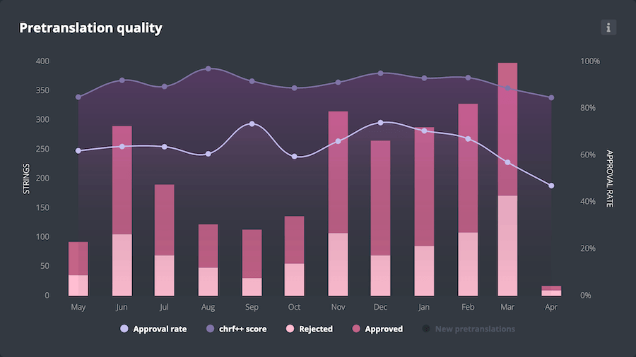
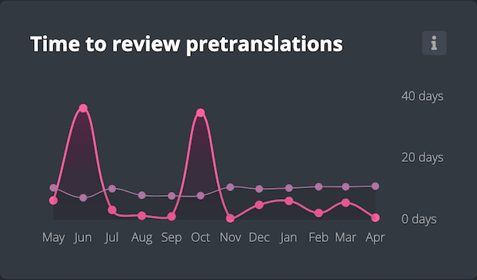

# Pretranslation

## What is pretranslation?

**Pretranslation** is a feature in Pontoon that allows strings to be translated automatically using a combination of [machine translation](pontoon/glossary.md#machine-translation) and [translation memory](pontoon/glossary.md#translation-memory). If pretranslation is enabled for a locale and project, when a new string is added to a project managed through Pontoon:

* It will be translated (pretranslated) using a 100% match from translation memory or, should that not be available, using the [Google AutoML Translation](https://cloud.google.com/translate/automl/docs) engine with a custom model.
* The string will be stored in Pontoon with a special *pretranslated* status. The pretranslated status can be used in filters within the translation interface, allowing localizers to easily review pretranslated strings, and either approve or reject them.
* The string will also be saved in the repository (e.g. GitHub), and eventually ship in the product.

While this comes with a potential compromise on quality, pretranslation brings the turn-around time to get a first translation to normally below 30 minutes.

Pretranslation uses [Google AutoML Translation](https://cloud.google.com/translate/automl/docs) as its machine translation engine, selected based on reliability, quality of results, and range of supported locales. The engine is fine-tuned by training it on our own existing translation memories, which increases the chances of matching existing style and terminology.

## Opt-in guidelines

To request pretranslation for your locale or a specific project, see [Requesting pretranslation](pontoon/teams_projects.html?highlight=pretranslation#requesting-pretranslation).

It's important to note that **these are not strict criteria**: members of staff will evaluate each request to opt in individually, based on their knowledge of the project and direct experience with the locale.

### Criteria for a new locale

* Request needs to come from translators or managers active within the last month (translating or reviewing).
* There is an active manager for the locale (last activity within 2 months).

### Criteria for a new project

* Less than 400 missing strings, except for projects or locales where existing pretranslation statistics provide high confidence.
* Average review time for pretranslations in existing projects is faster than 3 weeks.

### Criteria for disabling pretranslation

* Approval rate drops below 40%.
* Average review time for pretranslations is slower than 6 weeks.

Note that disabling a project would always involve a conversation with reviewers for the locale.

## Monitoring quality and time to review

When pretranslation is enabled and actively used, the **Insights** tab on a locale page (e.g. `https://pontoon.mozilla.org/fr/`) or a localization page (e.g. `https://pontoon.mozilla.org/fr/firefox`) includes a *Pretranslation quality* chart with monthly data:

* **Approved**: number of pretranslated strings approved as-is.
* **Rejected**: number of pretranslated strings rejected.
* **Approval rate**: percentage of pretranslated strings accepted.
* **New pretranslations**: total number of strings pretranslated that month.
* **[chrF++](https://aclanthology.org/W17-4770/) score**: an automatic quality metric computed on rejected strings — the closer to 100, the better. A high score means the rejected strings were close to correct and only needed minor edits.

The same Insights tab also includes a *Time to review pretranslations* chart, showing two lines of monthly data:

* **Average time that month**: average number of days between a string being pretranslated and it being reviewed that month.
* **12-month average**: rolling average of review time over the 12 months up to that month, useful for identifying longer-term trends.
